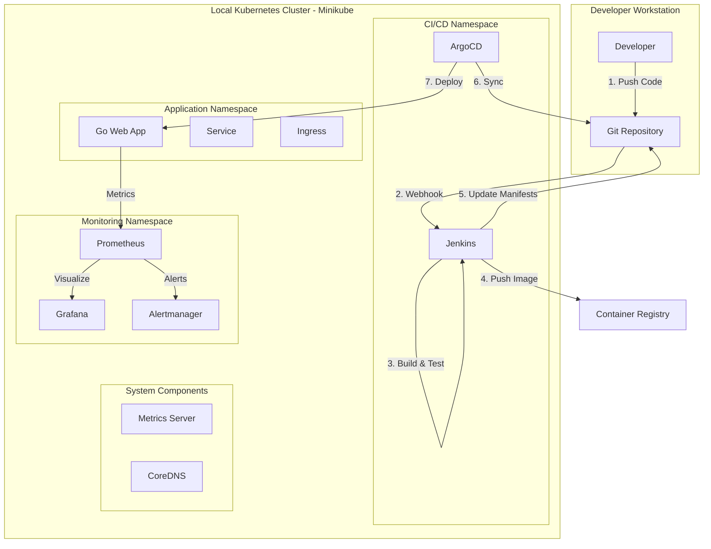
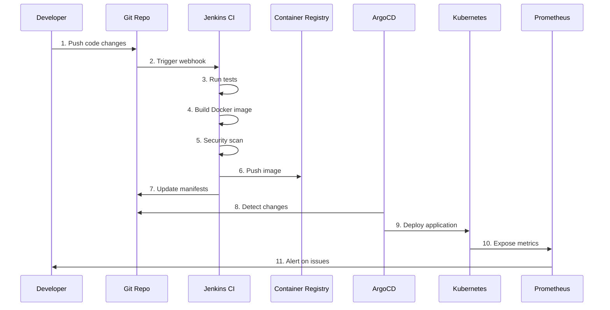

# Local Kubernetes CI/CD Environment - Complete Setup Guide

## 📋 Executive Summary

This guide provides a comprehensive, production-ready setup for a local Kubernetes CI/CD environment following industry best practices and SRE guidelines. The environment includes:

- **Local Kubernetes Cluster**: Minikube for local development
- **CI Pipeline**: Jenkins for continuous integration
- **CD Pipeline**: ArgoCD for GitOps-based continuous deployment
- **Monitoring Stack**: Prometheus & Grafana for observability
- **Demo Application**: Go-based web application with health endpoints
- **Additional Tools**: Helm, kubectl, kustomize, and essential Kubernetes utilities

### 🎯 Key Features

✅ **Production-Grade Setup**: Industry best practices for security, scalability, and reliability  
✅ **GitOps Workflow**: Declarative infrastructure and application management  
✅ **Complete Observability**: Metrics, logging, and alerting with Prometheus/Grafana  
✅ **Security First**: RBAC, Network Policies, Pod Security Standards  
✅ **Multi-Stage Builds**: Optimized Docker images with security scanning  
✅ **Infrastructure as Code**: All configurations version-controlled  

---

## 🏗️ Architecture Overview



### 🔄 CI/CD Workflow



---

## 📦 Technology Stack

| Component | Technology | Purpose |
|-----------|-----------|---------|
| **Container Runtime** | Docker | Container execution |
| **Kubernetes** | Minikube | Local K8s cluster |
| **CI Tool** | Jenkins | Build, test, package |
| **CD Tool** | ArgoCD | GitOps deployment |
| **Monitoring** | Prometheus | Metrics collection |
| **Visualization** | Grafana | Dashboards & alerts |
| **Package Manager** | Helm | K8s package management |
| **Manifest Tool** | Kustomize | Configuration management |
| **Service Mesh** | Istio (Optional) | Traffic management |
| **Secrets Management** | Sealed Secrets | Encrypted secrets in Git |

---

## 🚀 Quick Start Overview

### Prerequisites

- macOS operating system
- Docker Desktop installed and running
- 8GB+ RAM available for Minikube
- 20GB+ free disk space
- Homebrew package manager

### Setup Timeline

- **Minikube Setup**: ~10 minutes
- **Jenkins Installation**: ~15 minutes
- **ArgoCD Installation**: ~10 minutes
- **Monitoring Stack**: ~15 minutes
- **Demo App Deployment**: ~10 minutes
- **Total Time**: ~60 minutes

---

## 📚 Documentation Structure

This guide is organized into the following sections:

1. **[Environment Setup](./docs/01-environment-setup.md)**
   - Minikube installation and configuration
   - kubectl and essential tools
   - Cluster initialization

2. **[Jenkins Setup](./docs/02-jenkins-setup.md)**
   - Jenkins installation on Kubernetes
   - Plugin configuration
   - Pipeline setup and best practices

3. **[ArgoCD Setup](./docs/03-argocd-setup.md)**
   - ArgoCD installation
   - GitOps repository structure
   - Application deployment patterns

4. **[Monitoring Stack](./docs/04-monitoring-setup.md)**
   - Prometheus installation and configuration
   - Grafana dashboards
   - Alerting rules and notification channels

5. **[Demo Application](./docs/05-demo-application.md)**
   - Go web application structure
   - Dockerfile with multi-stage builds
   - Kubernetes manifests and Helm charts

6. **[CI/CD Pipeline](./docs/06-cicd-pipeline.md)**
   - Jenkins pipeline configuration
   - ArgoCD application setup
   - End-to-end workflow

7. **[Security Best Practices](./docs/07-security-practices.md)**
   - RBAC configuration
   - Network Policies
   - Pod Security Standards
   - Secrets management

8. **[Additional Tools](./docs/08-additional-tools.md)**
   - Helm installation and usage
   - Kustomize for configuration management
   - Sealed Secrets for GitOps
   - K9s for cluster management

9. **[Troubleshooting Guide](./docs/09-troubleshooting.md)**
   - Common issues and solutions
   - Debugging techniques
   - Performance optimization

10. **[Testing & Validation](./docs/10-testing-validation.md)**
    - Smoke tests
    - Integration tests
    - Performance benchmarks

---

## 🎓 SRE Best Practices Implemented

### 1. **Observability**

- ✅ Structured logging with log levels
- ✅ Prometheus metrics (RED method: Rate, Errors, Duration)
- ✅ Distributed tracing ready
- ✅ Custom dashboards for SLIs/SLOs

### 2. **Reliability**

- ✅ Health checks (liveness, readiness, startup probes)
- ✅ Resource limits and requests
- ✅ Horizontal Pod Autoscaling (HPA)
- ✅ Pod Disruption Budgets (PDB)
- ✅ Rolling updates with zero downtime

### 3. **Security**

- ✅ Non-root containers
- ✅ Read-only root filesystem
- ✅ Security contexts and capabilities
- ✅ Network policies for traffic control
- ✅ RBAC with least privilege principle
- ✅ Secrets encryption at rest

### 4. **Automation**

- ✅ GitOps for declarative deployments
- ✅ Automated testing in CI pipeline
- ✅ Automated rollbacks on failure
- ✅ Infrastructure as Code

### 5. **Scalability**

- ✅ Stateless application design
- ✅ Horizontal scaling capabilities
- ✅ Resource optimization
- ✅ Caching strategies

---

## 🔧 Additional Industry-Standard Tools Included

Beyond the core requirements, this guide includes:

1. **Helm** - Kubernetes package manager for templating and versioning
2. **Kustomize** - Native Kubernetes configuration management
3. **Sealed Secrets** - Encrypt secrets for safe Git storage
4. **K9s** - Terminal UI for Kubernetes cluster management
5. **Metrics Server** - Resource metrics for autoscaling
6. **Ingress NGINX** - Production-grade ingress controller
7. **cert-manager** (Optional) - Automated TLS certificate management
8. **Velero** (Optional) - Backup and disaster recovery
9. **Trivy** - Container vulnerability scanning
10. **Kubeval/Kubeconform** - Kubernetes manifest validation

---

## 📊 Monitoring & Alerting Strategy

### Metrics Collection

- **Application Metrics**: Custom business metrics, HTTP request metrics
- **Infrastructure Metrics**: CPU, memory, disk, network
- **Kubernetes Metrics**: Pod status, deployment health, resource usage

### Key Dashboards

1. **Cluster Overview**: Node health, resource utilization
2. **Application Performance**: Request rate, latency, error rate
3. **Jenkins Pipeline**: Build success rate, duration
4. **ArgoCD Sync Status**: Deployment health, sync frequency

### Alert Rules

- High error rate (>5% for 5 minutes)
- High latency (p95 >500ms for 5 minutes)
- Pod crash loops
- Resource exhaustion (>80% CPU/Memory)
- Failed deployments

---

## 🗂️ Repository Structure

```
.
├── README.md                          # This file
├── docs/                              # Detailed documentation
│   ├── 01-environment-setup.md
│   ├── 02-jenkins-setup.md
│   ├── 03-argocd-setup.md
│   ├── 04-monitoring-setup.md
│   ├── 05-demo-application.md
│   ├── 06-cicd-pipeline.md
│   ├── 07-security-practices.md
│   ├── 08-additional-tools.md
│   ├── 09-troubleshooting.md
│   └── 10-testing-validation.md
├── app/                               # Demo Go application
│   ├── main.go
│   ├── go.mod
│   ├── go.sum
│   ├── Dockerfile
│   └── README.md
├── k8s/                               # Kubernetes manifests
│   ├── base/                          # Base configurations
│   │   ├── deployment.yaml
│   │   ├── service.yaml
│   │   ├── configmap.yaml
│   │   └── kustomization.yaml
│   ├── overlays/                      # Environment-specific
│   │   ├── dev/
│   │   ├── staging/
│   │   └── prod/
│   └── helm/                          # Helm chart
│       └── go-web-app/
├── jenkins/                           # Jenkins configuration
│   ├── Jenkinsfile
│   ├── jenkins-deployment.yaml
│   └── plugins.txt
├── argocd/                            # ArgoCD applications
│   ├── application.yaml
│   └── project.yaml
├── monitoring/                        # Monitoring stack
│   ├── prometheus/
│   │   ├── prometheus-config.yaml
│   │   ├── alerting-rules.yaml
│   │   └── servicemonitor.yaml
│   └── grafana/
│       ├── dashboards/
│       └── datasources.yaml
└── scripts/                           # Automation scripts
    ├── setup-cluster.sh
    ├── install-jenkins.sh
    ├── install-argocd.sh
    └── install-monitoring.sh
```

---

## 🎯 Learning Outcomes

After completing this guide, you will:

1. ✅ Understand Kubernetes architecture and components
2. ✅ Implement GitOps workflows with ArgoCD
3. ✅ Build CI/CD pipelines with Jenkins
4. ✅ Configure comprehensive monitoring with Prometheus/Grafana
5. ✅ Apply security best practices (RBAC, Network Policies)
6. ✅ Use Helm and Kustomize for configuration management
7. ✅ Implement SRE principles (SLIs, SLOs, error budgets)
8. ✅ Debug and troubleshoot Kubernetes applications
9. ✅ Optimize resource utilization and costs
10. ✅ Prepare for CKA/CKAD certifications

---

## 🚦 Getting Started

Ready to begin? Start with [Environment Setup](./docs/01-environment-setup.md) to install and configure Minikube and essential tools.

### Quick Commands Reference

```bash
# Start Minikube cluster
minikube start --cpus=4 --memory=8192 --driver=docker

# Access Jenkins
kubectl port-forward -n jenkins svc/jenkins 8080:8080

# Access ArgoCD
kubectl port-forward -n argocd svc/argocd-server 8443:443

# Access Grafana
kubectl port-forward -n monitoring svc/grafana 3000:80

# Access Prometheus
kubectl port-forward -n monitoring svc/prometheus 9090:9090
```

---

## 📞 Support & Resources

- **Kubernetes Documentation**: <https://kubernetes.io/docs/>
- **Jenkins Documentation**: <https://www.jenkins.io/doc/>
- **ArgoCD Documentation**: <https://argo-cd.readthedocs.io/>
- **Prometheus Documentation**: <https://prometheus.io/docs/>
- **Grafana Documentation**: <https://grafana.com/docs/>

---

## 📝 License

This guide is provided as-is for educational purposes. Feel free to modify and adapt for your needs.

---

**Next Step**: Proceed to [01-environment-setup.md](./docs/01-environment-setup.md) to begin the setup process.
