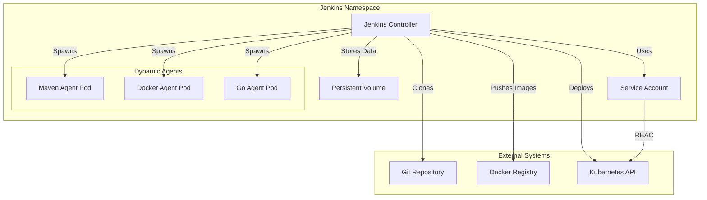

# 02 - Jenkins Setup on Kubernetes

## Overview

This guide covers the installation and configuration of Jenkins on Kubernetes using Helm, following production best practices and SRE principles. Jenkins will serve as our CI (Continuous Integration) platform, building and testing applications before deployment.

---

## Architecture



### Key Features

- ✅ **Persistent Storage**: Jenkins home directory on PVC
- ✅ **Dynamic Agents**: Kubernetes-based ephemeral build agents
- ✅ **Configuration as Code**: JCasC for reproducible setup
- ✅ **Security**: RBAC, secrets management, non-root containers
- ✅ **High Availability**: Ready for multi-controller setup
- ✅ **Monitoring**: Prometheus metrics integration

---

## Prerequisites

- Minikube cluster running (from [01-environment-setup.md](./01-environment-setup.md))
- kubectl configured
- Helm 3.x installed
- `jenkins` namespace created
- Minimum 2GB RAM and 2 CPU cores available

### Verify Prerequisites

```bash
# Check cluster
kubectl cluster-info

# Check namespace
kubectl get namespace jenkins

# Check Helm
helm version

# Check available resources
kubectl top nodes
```

---

## 1. Install Jenkins using Helm

### 1.1 Add Jenkins Helm Repository

```bash
# Add Jenkins Helm repository
helm repo add jenkins https://charts.jenkins.io

# Update Helm repositories
helm repo update

# Search for Jenkins chart
helm search repo jenkins/jenkins

# Expected output:
# NAME            CHART VERSION   APP VERSION     DESCRIPTION
# jenkins/jenkins 4.x.x          2.4xx.x         Jenkins - Build great things at any scale!
```

### 1.2 Create Jenkins Values File

Create `jenkins/values.yaml` with production-ready configuration:

```yaml
# Jenkins Helm Chart Values
# Production-ready configuration for Kubernetes

controller:
  # Jenkins controller configuration
  componentName: "jenkins-controller"
  image: "jenkins/jenkins"
  tag: "2.440.1-lts-jdk17"
  imagePullPolicy: "IfNotPresent"
  
  # Resource limits
  resources:
    requests:
      cpu: "500m"
      memory: "2Gi"
    limits:
      cpu: "2000m"
      memory: "4Gi"
  
  # Java options for performance
  javaOpts: >-
    -Xms2048m
    -Xmx2048m
    -XX:+UseG1GC
    -XX:+UseStringDeduplication
    -XX:+ParallelRefProcEnabled
    -XX:+DisableExplicitGC
    -Djava.awt.headless=true
    -Dhudson.model.DirectoryBrowserSupport.CSP="default-src 'self'; script-src 'self' 'unsafe-inline'; style-src 'self' 'unsafe-inline';"
  
  # Jenkins URL (update with your domain or use NodePort)
  jenkinsUrl: "http://jenkins.local:8080"
  jenkinsUriPrefix: "/"
  
  # Admin user configuration
  adminUser: "admin"
  # Admin password will be auto-generated and stored in secret
  # Retrieve with: kubectl get secret jenkins -n jenkins -o jsonpath='{.data.jenkins-admin-password}' | base64 -d
  
  # Number of executors on controller (keep low, use agents)
  numExecutors: 0
  
  # Security realm
  securityRealm: |-
    local:
      allowsSignup: false
      enableCaptcha: false
      users:
      - id: "${chart-admin-username}"
        name: "Jenkins Admin"
        password: "${chart-admin-password}"
  
  # Authorization strategy
  authorizationStrategy: |-
    loggedInUsersCanDoAnything:
      allowAnonymousRead: false
  
  # Install plugins
  installPlugins:
    # Essential plugins
    - kubernetes:4029.v5712230ccb_f8
    - workflow-aggregator:596.v8c21c963d92d
    - git:5.2.0
    - configuration-as-code:1670.v564dc8b_982d0
    
    # SCM plugins
    - github:1.37.3.1
    - github-branch-source:1728.v859147241f49
    - gitlab-plugin:1.7.15
    - bitbucket:223.vd12f2bca5430
    
    # Build tools
    - docker-workflow:572.v950f58993843
    - docker-plugin:1.5
    - pipeline-stage-view:2.33
    
    # Credentials
    - credentials-binding:631.v861e8e2d4d7a_
    - plain-credentials:143.v1b_df8b_d3b_e48
    - ssh-credentials:305.v8f4381501156
    
    # Notifications
    - slack:664.vc9a_90f8b_c24a_
    - email-ext:2.96
    - mailer:463.vedf8358e006b_
    
    # Monitoring
    - prometheus:2.2.3
    - metrics:4.2.13-420.vea_2f17932dd6
    
    # Security
    - matrix-auth:3.2.1
    - role-strategy:669.v5b_205b_a_67d50
    
    # Utilities
    - timestamper:1.25
    - ws-cleanup:0.45
    - build-timeout:1.31
    - ansicolor:1.0.2
    - pipeline-utility-steps:2.16.0
  
  # Additional plugins (optional)
  additionalPlugins:
    - blueocean:1.27.9
    - kubernetes-cli:1.12.1
    - job-dsl:1.84
    - pipeline-github-lib:38.v445716ea_edda_
  
  # Jenkins Configuration as Code (JCasC)
  JCasC:
    defaultConfig: true
    configScripts:
      welcome-message: |
        jenkins:
          systemMessage: |
            Welcome to Jenkins on Kubernetes!
            This Jenkins instance is configured using Configuration as Code.
            
            Environment: Development
            Cluster: Minikube Local
      
      kubernetes-cloud: |
        jenkins:
          clouds:
            - kubernetes:
                name: "kubernetes"
                serverUrl: "https://kubernetes.default"
                namespace: "jenkins"
                jenkinsUrl: "http://jenkins:8080"
                jenkinsTunnel: "jenkins-agent:50000"
                containerCapStr: "10"
                maxRequestsPerHostStr: "32"
                retentionTimeout: 5
                connectTimeout: 10
                readTimeout: 20
                
                templates:
                  - name: "jenkins-agent"
                    namespace: "jenkins"
                    label: "jenkins-agent"
                    nodeUsageMode: NORMAL
                    containers:
                      - name: "jnlp"
                        image: "jenkins/inbound-agent:latest"
                        alwaysPullImage: false
                        workingDir: "/home/jenkins/agent"
                        ttyEnabled: true
                        resourceRequestCpu: "500m"
                        resourceRequestMemory: "512Mi"
                        resourceLimitCpu: "1000m"
                        resourceLimitMemory: "1Gi"
                    
                    volumes:
                      - emptyDirVolume:
                          memory: false
                          mountPath: "/tmp"
                    
                    yaml: |
                      apiVersion: v1
                      kind: Pod
                      spec:
                        securityContext:
                          runAsUser: 1000
                          fsGroup: 1000
                  
                  - name: "docker-agent"
                    namespace: "jenkins"
                    label: "docker"
                    nodeUsageMode: NORMAL
                    containers:
                      - name: "docker"
                        image: "docker:24-dind"
                        alwaysPullImage: false
                        workingDir: "/home/jenkins/agent"
                        ttyEnabled: true
                        privileged: true
                        resourceRequestCpu: "500m"
                        resourceRequestMemory: "1Gi"
                        resourceLimitCpu: "2000m"
                        resourceLimitMemory: "2Gi"
                        command: "dockerd-entrypoint.sh"
                      - name: "jnlp"
                        image: "jenkins/inbound-agent:latest"
                        alwaysPullImage: false
                        workingDir: "/home/jenkins/agent"
                        ttyEnabled: true
                        resourceRequestCpu: "200m"
                        resourceRequestMemory: "256Mi"
                        resourceLimitCpu: "500m"
                        resourceLimitMemory: "512Mi"
                  
                  - name: "go-agent"
                    namespace: "jenkins"
                    label: "golang"
                    nodeUsageMode: NORMAL
                    containers:
                      - name: "golang"
                        image: "golang:1.21"
                        alwaysPullImage: false
                        workingDir: "/home/jenkins/agent"
                        ttyEnabled: true
                        command: "cat"
                        resourceRequestCpu: "500m"
                        resourceRequestMemory: "512Mi"
                        resourceLimitCpu: "1000m"
                        resourceLimitMemory: "1Gi"
                      - name: "jnlp"
                        image: "jenkins/inbound-agent:latest"
                        alwaysPullImage: false
                        workingDir: "/home/jenkins/agent"
                        ttyEnabled: true
      
      security-settings: |
        jenkins:
          securityRealm:
            local:
              allowsSignup: false
          authorizationStrategy:
            loggedInUsersCanDoAnything:
              allowAnonymousRead: false
          
          remotingSecurity:
            enabled: true
          
          crumbIssuer:
            standard:
              excludeClientIPFromCrumb: false
      
      global-libraries: |
        unclassified:
          globalLibraries:
            libraries:
              - name: "shared-library"
                defaultVersion: "main"
                implicit: false
                allowVersionOverride: true
                retriever:
                  modernSCM:
                    scm:
                      git:
                        remote: "https://github.com/your-org/jenkins-shared-library.git"
  
  # Ingress configuration
  ingress:
    enabled: true
    apiVersion: "networking.k8s.io/v1"
    annotations:
      kubernetes.io/ingress.class: nginx
      nginx.ingress.kubernetes.io/ssl-redirect: "false"
      nginx.ingress.kubernetes.io/proxy-body-size: "50m"
      nginx.ingress.kubernetes.io/proxy-request-buffering: "off"
    hostName: jenkins.local
    path: /
    pathType: Prefix
  
  # Service configuration
  serviceType: ClusterIP
  servicePort: 8080
  targetPort: 8080
  
  # Agent listener service
  agentListenerServiceType: ClusterIP
  
  # Health probes
  healthProbes: true
  healthProbesLivenessTimeout: 5
  healthProbesReadinessTimeout: 5
  healthProbeLivenessPeriodSeconds: 10
  healthProbeReadinessPeriodSeconds: 10
  healthProbeLivenessFailureThreshold: 5
  healthProbeReadinessFailureThreshold: 3
  healthProbeLivenessInitialDelay: 90
  healthProbeReadinessInitialDelay: 60
  
  # Prometheus monitoring
  prometheus:
    enabled: true
    serviceMonitorNamespace: "monitoring"
    serviceMonitorAdditionalLabels:
      release: prometheus

# Persistence configuration
persistence:
  enabled: true
  existingClaim: ""
  storageClass: "standard"
  accessMode: "ReadWriteOnce"
  size: "20Gi"
  volumes: []
  mounts: []

# Service Account
serviceAccount:
  create: true
  name: jenkins
  annotations: {}

# RBAC
rbac:
  create: true
  readSecrets: true

# Network Policy
networkPolicy:
  enabled: true
  apiVersion: networking.k8s.io/v1
  internalAgents:
    allowed: true
    namespaceLabels:
      name: "jenkins"

# Backup configuration (optional)
backup:
  enabled: false
  schedule: "0 2 * * *"
  annotations: {}
```

### 1.3 Install Jenkins

```bash
# Create jenkins namespace if not exists
kubectl create namespace jenkins --dry-run=client -o yaml | kubectl apply -f -

# Install Jenkins using Helm
helm install jenkins jenkins/jenkins \
  --namespace jenkins \
  --values jenkins/values.yaml \
  --wait \
  --timeout 10m

# Expected output:
# NAME: jenkins
# LAST DEPLOYED: [timestamp]
# NAMESPACE: jenkins
# STATUS: deployed
# REVISION: 1
```

### 1.4 Verify Installation

```bash
# Check Jenkins pod status
kubectl get pods -n jenkins

# Expected output:
# NAME        READY   STATUS    RESTARTS   AGE
# jenkins-0   2/2     Running   0          2m

# Check Jenkins service
kubectl get svc -n jenkins

# Check PVC
kubectl get pvc -n jenkins

# Check logs
kubectl logs -n jenkins jenkins-0 -c jenkins --tail=50
```

---

## 2. Access Jenkins

### 2.1 Get Admin Password

```bash
# Retrieve auto-generated admin password
kubectl get secret jenkins -n jenkins -o jsonpath='{.data.jenkins-admin-password}' | base64 -d
echo

# Save this password for initial login
```

### 2.2 Access via Port Forward

```bash
# Forward Jenkins port to localhost
kubectl port-forward -n jenkins svc/jenkins 8080:8080

# Access Jenkins at: http://localhost:8080
# Username: admin
# Password: [from previous step]
```

### 2.3 Access via Ingress (if configured)

```bash
# Get Minikube IP
minikube ip

# Add to /etc/hosts (replace <MINIKUBE_IP>)
echo "<MINIKUBE_IP> jenkins.local" | sudo tee -a /etc/hosts

# Access Jenkins at: http://jenkins.local
```

---

## 3. Configure Jenkins

### 3.1 Initial Setup Wizard

Since we're using JCasC, the setup wizard is bypassed. Jenkins is pre-configured with:
- Admin user created
- Plugins installed
- Kubernetes cloud configured
- Security settings applied

### 3.2 Verify Kubernetes Cloud Configuration

1. Navigate to **Manage Jenkins** → **Manage Nodes and Clouds** → **Configure Clouds**
2. Verify "kubernetes" cloud is configured
3. Test connection to Kubernetes API
4. Verify pod templates are configured

### 3.3 Create Test Pipeline

Create a test pipeline to verify Kubernetes agent provisioning:

```groovy
// Test Pipeline
pipeline {
    agent {
        kubernetes {
            label 'jenkins-agent'
            defaultContainer 'jnlp'
        }
    }
    
    stages {
        stage('Test') {
            steps {
                sh 'echo "Hello from Kubernetes agent!"'
                sh 'hostname'
                sh 'kubectl version --client'
            }
        }
    }
}
```

---

## 4. Configure RBAC for Jenkins

### 4.1 Create ServiceAccount with Permissions

Create `jenkins/rbac.yaml`:

```yaml
---
apiVersion: v1
kind: ServiceAccount
metadata:
  name: jenkins
  namespace: jenkins
---
apiVersion: rbac.authorization.k8s.io/v1
kind: ClusterRole
metadata:
  name: jenkins
rules:
  # Pods
  - apiGroups: [""]
    resources: ["pods"]
    verbs: ["create", "delete", "get", "list", "patch", "update", "watch"]
  - apiGroups: [""]
    resources: ["pods/exec"]
    verbs: ["create", "delete", "get", "list", "patch", "update", "watch"]
  - apiGroups: [""]
    resources: ["pods/log"]
    verbs: ["get", "list", "watch"]
  
  # Secrets (for credentials)
  - apiGroups: [""]
    resources: ["secrets"]
    verbs: ["get", "list", "watch"]
  
  # ConfigMaps
  - apiGroups: [""]
    resources: ["configmaps"]
    verbs: ["get", "list", "watch"]
  
  # Services
  - apiGroups: [""]
    resources: ["services"]
    verbs: ["get", "list", "watch"]
  
  # Deployments (for CD)
  - apiGroups: ["apps"]
    resources: ["deployments"]
    verbs: ["get", "list", "watch", "create", "update", "patch", "delete"]
  
  # ReplicaSets
  - apiGroups: ["apps"]
    resources: ["replicasets"]
    verbs: ["get", "list", "watch"]
  
  # StatefulSets
  - apiGroups: ["apps"]
    resources: ["statefulsets"]
    verbs: ["get", "list", "watch"]
  
  # Namespaces
  - apiGroups: [""]
    resources: ["namespaces"]
    verbs: ["get", "list", "watch"]
---
apiVersion: rbac.authorization.k8s.io/v1
kind: ClusterRoleBinding
metadata:
  name: jenkins
roleRef:
  apiGroup: rbac.authorization.k8s.io
  kind: ClusterRole
  name: jenkins
subjects:
  - kind: ServiceAccount
    name: jenkins
    namespace: jenkins
---
# Role for managing resources in demo-app namespace
apiVersion: rbac.authorization.k8s.io/v1
kind: Role
metadata:
  name: jenkins-deploy
  namespace: demo-app
rules:
  - apiGroups: ["", "apps", "networking.k8s.io"]
    resources: ["*"]
    verbs: ["*"]
---
apiVersion: rbac.authorization.k8s.io/v1
kind: RoleBinding
metadata:
  name: jenkins-deploy
  namespace: demo-app
roleRef:
  apiGroup: rbac.authorization.k8s.io
  kind: Role
  name: jenkins-deploy
subjects:
  - kind: ServiceAccount
    name: jenkins
    namespace: jenkins
```

Apply RBAC configuration:

```bash
kubectl apply -f jenkins/rbac.yaml

# Verify
kubectl get sa jenkins -n jenkins
kubectl get clusterrole jenkins
kubectl get clusterrolebinding jenkins
```

---

## 5. Configure Credentials

### 5.1 Add Docker Registry Credentials

```bash
# Create Docker registry secret
kubectl create secret docker-registry docker-registry-creds \
  --docker-server=https://index.docker.io/v1/ \
  --docker-username=<your-username> \
  --docker-password=<your-password> \
  --docker-email=<your-email> \
  -n jenkins

# Or for Docker Hub token
kubectl create secret docker-registry docker-registry-creds \
  --docker-server=https://index.docker.io/v1/ \
  --docker-username=<your-username> \
  --docker-password=<your-token> \
  --docker-email=<your-email> \
  -n jenkins
```

### 5.2 Add Git Credentials (if private repo)

```bash
# Create SSH key secret for Git
kubectl create secret generic git-ssh-key \
  --from-file=ssh-privatekey=/path/to/your/private/key \
  -n jenkins

# Or create token secret
kubectl create secret generic git-token \
  --from-literal=token=<your-git-token> \
  -n jenkins
```

### 5.3 Configure Credentials in Jenkins UI

1. Navigate to **Manage Jenkins** → **Manage Credentials**
2. Click on **(global)** domain
3. Add credentials:
   - **Docker Registry**: Username with password
   - **Git**: SSH Username with private key or Secret text (token)
   - **Kubernetes**: Service Account (auto-configured)

---

## 6. Install Additional Plugins (Optional)

### 6.1 Via Jenkins UI

1. Navigate to **Manage Jenkins** → **Manage Plugins**
2. Go to **Available** tab
3. Search and install:
   - Blue Ocean (modern UI)
   - Pipeline: GitHub Groovy Libraries
   - OWASP Dependency-Check
   - SonarQube Scanner
   - Trivy (container scanning)

### 6.2 Via JCasC

Add to `values.yaml` under `installPlugins`:

```yaml
installPlugins:
  - blueocean:1.27.9
  - dependency-check-jenkins-plugin:5.4.1
  - sonar:2.16.1
  - aqua-security-scanner:3.0.22
```

Update Jenkins:

```bash
helm upgrade jenkins jenkins/jenkins \
  --namespace jenkins \
  --values jenkins/values.yaml \
  --wait
```

---

## 7. Configure Monitoring

### 7.1 Enable Prometheus Metrics

Metrics are already enabled in `values.yaml`. Verify:

```bash
# Check if metrics endpoint is accessible
kubectl port-forward -n jenkins svc/jenkins 8080:8080

# In another terminal
curl http://localhost:8080/prometheus/

# Should return Prometheus metrics
```

### 7.2 Create ServiceMonitor

Create `jenkins/servicemonitor.yaml`:

```yaml
apiVersion: monitoring.coreos.com/v1
kind: ServiceMonitor
metadata:
  name: jenkins
  namespace: monitoring
  labels:
    app: jenkins
    release: prometheus
spec:
  selector:
    matchLabels:
      app.kubernetes.io/name: jenkins
  namespaceSelector:
    matchNames:
      - jenkins
  endpoints:
    - port: http
      path: /prometheus
      interval: 30s
      scrapeTimeout: 10s
```

Apply ServiceMonitor:

```bash
kubectl apply -f jenkins/servicemonitor.yaml

# Verify
kubectl get servicemonitor -n monitoring
```

---

## 8. Backup and Restore

### 8.1 Manual Backup

```bash
# Backup Jenkins home directory
kubectl exec -n jenkins jenkins-0 -- tar czf /tmp/jenkins-backup.tar.gz -C /var/jenkins_home .

# Copy backup to local machine
kubectl cp jenkins/jenkins-0:/tmp/jenkins-backup.tar.gz ./jenkins-backup-$(date +%Y%m%d).tar.gz

# Clean up
kubectl exec -n jenkins jenkins-0 -- rm /tmp/jenkins-backup.tar.gz
```

### 8.2 Automated Backup with CronJob

Create `jenkins/backup-cronjob.yaml`:

```yaml
apiVersion: batch/v1
kind: CronJob
metadata:
  name: jenkins-backup
  namespace: jenkins
spec:
  schedule: "0 2 * * *"  # Daily at 2 AM
  successfulJobsHistoryLimit: 3
  failedJobsHistoryLimit: 1
  jobTemplate:
    spec:
      template:
        spec:
          serviceAccountName: jenkins
          containers:
            - name: backup
              image: bitnami/kubectl:latest
              command:
                - /bin/sh
                - -c
                - |
                  kubectl exec jenkins-0 -n jenkins -- tar czf /tmp/jenkins-backup.tar.gz -C /var/jenkins_home .
                  kubectl cp jenkins/jenkins-0:/tmp/jenkins-backup.tar.gz /backups/jenkins-backup-$(date +%Y%m%d-%H%M%S).tar.gz
                  kubectl exec jenkins-0 -n jenkins -- rm /tmp/jenkins-backup.tar.gz
              volumeMounts:
                - name: backup-storage
                  mountPath: /backups
          volumes:
            - name: backup-storage
              persistentVolumeClaim:
                claimName: jenkins-backup-pvc
          restartPolicy: OnFailure
```

### 8.3 Restore from Backup

```bash
# Copy backup to Jenkins pod
kubectl cp ./jenkins-backup-20240101.tar.gz jenkins/jenkins-0:/tmp/

# Extract backup
kubectl exec -n jenkins jenkins-0 -- tar xzf /tmp/jenkins-backup.tar.gz -C /var/jenkins_home

# Restart Jenkins
kubectl rollout restart statefulset jenkins -n jenkins

# Wait for Jenkins to be ready
kubectl wait --for=condition=ready pod -l app.kubernetes.io/name=jenkins -n jenkins --timeout=300s
```

---

## 9. Security Hardening

### 9.1 Enable CSRF Protection

Already enabled via JCasC. Verify in **Manage Jenkins** → **Configure Global Security** → **CSRF Protection**.

### 9.2 Configure Agent-to-Controller Security

```yaml
# Add to JCasC configuration
jenkins:
  remotingSecurity:
    enabled: true
  
  agentProtocols:
    - "JNLP4-connect"
    - "Ping"
```

### 9.3 Restrict Script Execution

1. Navigate to **Manage Jenkins** → **Configure Global Security**
2. Under **Script Security**, enable:
   - In-process Script Approval
   - Sandbox for Groovy scripts

### 9.4 Enable Audit Logging

Install Audit Trail plugin and configure:

```yaml
# Add to JCasC
unclassified:
  auditTrail:
    loggers:
      - logFile:
          log: /var/jenkins_home/logs/audit.log
          limit: 10
          count: 5
```

---

## 10. Performance Tuning

### 10.1 Optimize Java Heap

Already configured in `values.yaml`:

```yaml
javaOpts: >-
  -Xms2048m
  -Xmx2048m
  -XX:+UseG1GC
```

### 10.2 Configure Build Discarder

Add to pipeline or configure globally:

```groovy
properties([
    buildDiscarder(logRotator(
        numToKeepStr: '10',
        artifactNumToKeepStr: '5'
    ))
])
```

### 10.3 Limit Concurrent Builds

```yaml
# In JCasC
jenkins:
  numExecutors: 0  # No builds on controller
  clouds:
    - kubernetes:
        containerCapStr: "10"  # Max 10 concurrent agents
```

---

## 11. Troubleshooting

### Issue 1: Jenkins Pod Not Starting

```bash
# Check pod status
kubectl describe pod jenkins-0 -n jenkins

# Check logs
kubectl logs jenkins-0 -n jenkins -c jenkins

# Common causes:
# - Insufficient resources
# - PVC not bound
# - Image pull errors
```

### Issue 2: Agents Not Connecting

```bash
# Check agent service
kubectl get svc jenkins-agent -n jenkins

# Check Jenkins logs for agent connection errors
kubectl logs jenkins-0 -n jenkins -c jenkins | grep -i agent

# Verify JNLP port is accessible
kubectl port-forward -n jenkins svc/jenkins-agent 50000:50000
```

### Issue 3: Plugins Not Installing

```bash
# Check plugin installation logs
kubectl logs jenkins-0 -n jenkins -c init

# Manually install plugins
kubectl exec -n jenkins jenkins-0 -- jenkins-plugin-cli --plugins <plugin-name>

# Restart Jenkins
kubectl rollout restart statefulset jenkins -n jenkins
```

### Issue 4: Out of Memory

```bash
# Increase memory limits
helm upgrade jenkins jenkins/jenkins \
  --namespace jenkins \
  --set controller.resources.limits.memory=6Gi \
  --reuse-values

# Or edit values.yaml and upgrade
```

---

## 12. Useful Commands

```bash
# Get Jenkins URL
kubectl get ingress -n jenkins

# Get admin password
kubectl get secret jenkins -n jenkins -o jsonpath='{.data.jenkins-admin-password}' | base64 -d

# Restart Jenkins
kubectl rollout restart statefulset jenkins -n jenkins

# Scale Jenkins (for maintenance)
kubectl scale statefulset jenkins -n jenkins --replicas=0
kubectl scale statefulset jenkins -n jenkins --replicas=1

# View Jenkins logs
kubectl logs -n jenkins jenkins-0 -c jenkins -f

# Execute command in Jenkins pod
kubectl exec -n jenkins jenkins-0 -it -- /bin/bash

# Check Jenkins version
kubectl exec -n jenkins jenkins-0 -- cat /usr/share/jenkins/ref/jenkins.war | jar xf /dev/stdin META-INF/MANIFEST.MF && cat META-INF/MANIFEST.MF | grep Jenkins-Version
```

---

## 13. Automation Script

Create `scripts/install-jenkins.sh`:

```bash
#!/bin/bash
set -e

echo "🚀 Installing Jenkins on Kubernetes..."

# Add Helm repository
helm repo add jenkins https://charts.jenkins.io
helm repo update

# Create namespace
kubectl create namespace jenkins --dry-run=client -o yaml | kubectl apply -f -

# Install Jenkins
helm install jenkins jenkins/jenkins \
  --namespace jenkins \
  --values jenkins/values.yaml \
  --wait \
  --timeout 10m

# Wait for Jenkins to be ready
echo "⏳ Waiting for Jenkins to be ready..."
kubectl wait --for=condition=ready pod -l app.kubernetes.io/name=jenkins -n jenkins --timeout=300s

# Get admin password
echo ""
echo "✅ Jenkins installed successfully!"
echo ""
echo "Admin Password:"
kubectl get secret jenkins -n jenkins -o jsonpath='{.data.jenkins-admin-password}' | base64 -d
echo ""
echo ""
echo "Access Jenkins:"
echo "  Port Forward: kubectl port-forward -n jenkins svc/jenkins 8080:8080"
echo "  URL: http://localhost:8080"
echo "  Username: admin"
```

Make it executable:

```bash
chmod +x scripts/install-jenkins.sh
```

---

## 14. Verification Checklist

Before proceeding to the next section, verify:

- [ ] Jenkins pod is running
- [ ] Jenkins is accessible via port-forward or ingress
- [ ] Admin login works
- [ ] Kubernetes cloud is configured
- [ ] Test pipeline runs successfully on Kubernetes agent
- [ ] Plugins are installed
- [ ] RBAC is configured
- [ ] Credentials are added
- [ ] Prometheus metrics are exposed

### Verification Script

```bash
#!/bin/bash

echo "=== Jenkins Verification ==="

echo -e "\n1. Pod Status:"
kubectl get pods -n jenkins

echo -e "\n2. Service Status:"
kubectl get svc -n jenkins

echo -e "\n3. PVC Status:"
kubectl get pvc -n jenkins

echo -e "\n4. Ingress Status:"
kubectl get ingress -n jenkins

echo -e "\n5. ServiceAccount:"
kubectl get sa jenkins -n jenkins

echo -e "\n6. RBAC:"
kubectl get clusterrole jenkins
kubectl get clusterrolebinding jenkins

echo -e "\n7. Admin Password:"
kubectl get secret jenkins -n jenkins -o jsonpath='{.data.jenkins-admin-password}' | base64 -d
echo ""

echo -e "\n✅ Verification complete!"
```

---

## Next Steps

Now that Jenkins is set up, proceed to:
- **[03-argocd-setup.md](./03-argocd-setup.md)** - Install and configure ArgoCD for CD

---

## Additional Resources

- [Jenkins Documentation](https://www.jenkins.io/doc/)
- [Jenkins Kubernetes Plugin](https://plugins.jenkins.io/kubernetes/)
- [Jenkins Configuration as Code](https://github.com/jenkinsci/configuration-as-code-plugin)
- [Jenkins Helm Chart](https://github.com/jenkinsci/helm-charts)
- [Jenkins Best Practices](https://www.jenkins.io/doc/book/using/best-practices/)