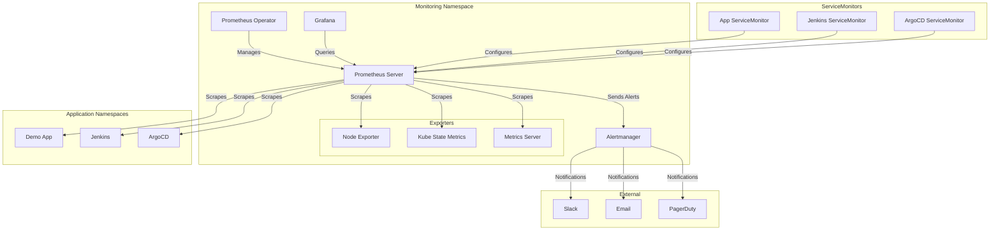

# 04 - Monitoring Stack Setup (Prometheus & Grafana)

## Overview

This guide covers the installation and configuration of a complete monitoring stack using Prometheus and Grafana on Kubernetes. We'll implement comprehensive observability following SRE best practices, including metrics collection, visualization, and alerting.

---

## Architecture



### Key Features

- ✅ **Prometheus Operator**: Automated Prometheus management
- ✅ **Service Discovery**: Automatic target discovery via ServiceMonitors
- ✅ **Multi-Tenant**: Separate metrics per namespace
- ✅ **Alerting**: Comprehensive alert rules with Alertmanager
- ✅ **Visualization**: Pre-built Grafana dashboards
- ✅ **High Availability**: Prometheus and Alertmanager HA setup
- ✅ **Persistent Storage**: Long-term metrics retention
- ✅ **Security**: RBAC and network policies

---

## Prerequisites

- Minikube cluster running
- kubectl configured
- Helm 3.x installed
- `monitoring` namespace created
- Minimum 4GB RAM and 2 CPU cores available

### Verify Prerequisites

```bash
# Check cluster
kubectl cluster-info

# Check namespace
kubectl get namespace monitoring

# Check available resources
kubectl top nodes
```

---

## 1. Install Prometheus Stack using Helm

### 1.1 Add Prometheus Community Helm Repository

```bash
# Add Prometheus community Helm repository
helm repo add prometheus-community https://prometheus-community.github.io/helm-charts

# Add Grafana Helm repository
helm repo add grafana https://grafana.github.io/helm-charts

# Update Helm repositories
helm repo update

# Search for kube-prometheus-stack chart
helm search repo prometheus-community/kube-prometheus-stack

# Expected output:
# NAME                                              CHART VERSION   APP VERSION     DESCRIPTION
# prometheus-community/kube-prometheus-stack        55.x.x          v0.70.x         kube-prometheus-stack collects Kubernetes manif...
```

### 1.2 Create Prometheus Stack Values File

Create `monitoring/prometheus-values.yaml`:

```yaml
# Prometheus Stack Helm Chart Values
# Production-ready configuration

# Global settings
global:
  rbac:
    create: true

# Prometheus Operator
prometheusOperator:
  enabled: true
  
  resources:
    limits:
      cpu: 200m
      memory: 512Mi
    requests:
      cpu: 100m
      memory: 256Mi
  
  # Admission webhooks
  admissionWebhooks:
    enabled: true
    patch:
      enabled: true

# Prometheus Server
prometheus:
  enabled: true
  
  prometheusSpec:
    # Retention period
    retention: 15d
    retentionSize: "10GB"
    
    # Resource limits
    resources:
      requests:
        cpu: 500m
        memory: 2Gi
      limits:
        cpu: 2000m
        memory: 4Gi
    
    # Storage configuration
    storageSpec:
      volumeClaimTemplate:
        spec:
          storageClassName: standard
          accessModes: ["ReadWriteOnce"]
          resources:
            requests:
              storage: 20Gi
    
    # Service monitor selector
    serviceMonitorSelector: {}
    serviceMonitorNamespaceSelector: {}
    
    # Pod monitor selector
    podMonitorSelector: {}
    podMonitorNamespaceSelector: {}
    
    # Rule selector
    ruleSelector: {}
    ruleNamespaceSelector: {}
    
    # Scrape interval
    scrapeInterval: 30s
    evaluationInterval: 30s
    
    # External labels
    externalLabels:
      cluster: minikube-local
      environment: development
    
    # Additional scrape configs
    additionalScrapeConfigs: []
    
    # Replicas for HA (set to 1 for local dev)
    replicas: 1
    
    # Security context
    securityContext:
      runAsNonRoot: true
      runAsUser: 1000
      fsGroup: 2000
    
    # Enable admin API
    enableAdminAPI: false
    
    # Remote write (optional - for long-term storage)
    # remoteWrite:
    #   - url: "http://thanos-receive:19291/api/v1/receive"

# Alertmanager
alertmanager:
  enabled: true
  
  alertmanagerSpec:
    # Resource limits
    resources:
      requests:
        cpu: 100m
        memory: 256Mi
      limits:
        cpu: 200m
        memory: 512Mi
    
    # Storage
    storage:
      volumeClaimTemplate:
        spec:
          storageClassName: standard
          accessModes: ["ReadWriteOnce"]
          resources:
            requests:
              storage: 5Gi
    
    # Replicas for HA
    replicas: 1
    
    # Security context
    securityContext:
      runAsNonRoot: true
      runAsUser: 1000
      fsGroup: 2000
  
  # Alertmanager configuration
  config:
    global:
      resolve_timeout: 5m
      slack_api_url: 'https://hooks.slack.com/services/YOUR/SLACK/WEBHOOK'
    
    route:
      group_by: ['alertname', 'cluster', 'service']
      group_wait: 10s
      group_interval: 10s
      repeat_interval: 12h
      receiver: 'default'
      routes:
        - match:
            severity: critical
          receiver: critical
          continue: true
        - match:
            severity: warning
          receiver: warning
    
    receivers:
      - name: 'default'
        slack_configs:
          - channel: '#alerts'
            title: 'Kubernetes Alert'
            text: '{{ range .Alerts }}{{ .Annotations.description }}{{ end }}'
      
      - name: 'critical'
        slack_configs:
          - channel: '#alerts-critical'
            title: '🚨 Critical Alert'
            text: '{{ range .Alerts }}{{ .Annotations.description }}{{ end }}'
        # email_configs:
        #   - to: 'oncall@example.com'
        #     from: 'alertmanager@example.com'
        #     smarthost: 'smtp.gmail.com:587'
        #     auth_username: 'alertmanager@example.com'
        #     auth_password: 'password'
      
      - name: 'warning'
        slack_configs:
          - channel: '#alerts-warning'
            title: '⚠️ Warning Alert'
            text: '{{ range .Alerts }}{{ .Annotations.description }}{{ end }}'

# Grafana
grafana:
  enabled: true
  
  # Admin credentials
  adminPassword: admin123  # Change in production!
  
  # Resource limits
  resources:
    limits:
      cpu: 500m
      memory: 512Mi
    requests:
      cpu: 100m
      memory: 128Mi
  
  # Persistence
  persistence:
    enabled: true
    storageClassName: standard
    accessModes:
      - ReadWriteOnce
    size: 5Gi
  
  # Ingress
  ingress:
    enabled: true
    ingressClassName: nginx
    annotations:
      nginx.ingress.kubernetes.io/ssl-redirect: "false"
    hosts:
      - grafana.local
    path: /
  
  # Datasources
  datasources:
    datasources.yaml:
      apiVersion: 1
      datasources:
        - name: Prometheus
          type: prometheus
          url: http://prometheus-kube-prometheus-prometheus:9090
          access: proxy
          isDefault: true
          jsonData:
            timeInterval: 30s
  
  # Dashboard providers
  dashboardProviders:
    dashboardproviders.yaml:
      apiVersion: 1
      providers:
        - name: 'default'
          orgId: 1
          folder: ''
          type: file
          disableDeletion: false
          editable: true
          options:
            path: /var/lib/grafana/dashboards/default
  
  # Pre-installed dashboards
  dashboards:
    default:
      # Kubernetes cluster monitoring
      kubernetes-cluster:
        gnetId: 7249
        revision: 1
        datasource: Prometheus
      
      # Node exporter
      node-exporter:
        gnetId: 1860
        revision: 27
        datasource: Prometheus
      
      # Kubernetes pods
      kubernetes-pods:
        gnetId: 6417
        revision: 1
        datasource: Prometheus
      
      # Kubernetes deployment
      kubernetes-deployment:
        gnetId: 8588
        revision: 1
        datasource: Prometheus
  
  # Grafana configuration
  grafana.ini:
    server:
      root_url: http://grafana.local
    analytics:
      check_for_updates: false
    security:
      admin_user: admin
      admin_password: admin123
    users:
      allow_sign_up: false
    auth.anonymous:
      enabled: false

# Node Exporter
nodeExporter:
  enabled: true
  
  resources:
    limits:
      cpu: 200m
      memory: 128Mi
    requests:
      cpu: 50m
      memory: 64Mi

# Kube State Metrics
kubeStateMetrics:
  enabled: true
  
  resources:
    limits:
      cpu: 200m
      memory: 256Mi
    requests:
      cpu: 50m
      memory: 128Mi

# Prometheus Node Exporter
prometheus-node-exporter:
  resources:
    limits:
      cpu: 200m
      memory: 128Mi
    requests:
      cpu: 50m
      memory: 64Mi

# Default rules
defaultRules:
  create: true
  rules:
    alertmanager: true
    etcd: false  # Not applicable for Minikube
    configReloaders: true
    general: true
    k8s: true
    kubeApiserver: true
    kubeApiserverAvailability: true
    kubeApiserverSlos: true
    kubelet: true
    kubeProxy: true
    kubePrometheusGeneral: true
    kubePrometheusNodeRecording: true
    kubernetesApps: true
    kubernetesResources: true
    kubernetesStorage: true
    kubernetesSystem: true
    kubeScheduler: true
    kubeStateMetrics: true
    network: true
    node: true
    nodeExporterAlerting: true
    nodeExporterRecording: true
    prometheus: true
    prometheusOperator: true

# Additional components
kubeControllerManager:
  enabled: false  # Not accessible in Minikube

kubeScheduler:
  enabled: false  # Not accessible in Minikube

kubeEtcd:
  enabled: false  # Not accessible in Minikube

kubeProxy:
  enabled: true
```

### 1.3 Install Prometheus Stack

```bash
# Create monitoring namespace
kubectl create namespace monitoring --dry-run=client -o yaml | kubectl apply -f -

# Install kube-prometheus-stack
helm install prometheus prometheus-community/kube-prometheus-stack \
  --namespace monitoring \
  --values monitoring/prometheus-values.yaml \
  --wait \
  --timeout 10m

# Expected output:
# NAME: prometheus
# LAST DEPLOYED: [timestamp]
# NAMESPACE: monitoring
# STATUS: deployed
# REVISION: 1
```

### 1.4 Verify Installation

```bash
# Check all monitoring pods
kubectl get pods -n monitoring

# Expected output:
# NAME                                                     READY   STATUS    RESTARTS   AGE
# alertmanager-prometheus-kube-prometheus-alertmanager-0   2/2     Running   0          2m
# prometheus-grafana-xxxxxxxxxx-xxxxx                      3/3     Running   0          2m
# prometheus-kube-prometheus-operator-xxxxxxxxxx-xxxxx     1/1     Running   0          2m
# prometheus-kube-state-metrics-xxxxxxxxxx-xxxxx           1/1     Running   0          2m
# prometheus-prometheus-kube-prometheus-prometheus-0       2/2     Running   0          2m
# prometheus-prometheus-node-exporter-xxxxx                1/1     Running   0          2m

# Check services
kubectl get svc -n monitoring

# Check PVCs
kubectl get pvc -n monitoring
```

---

## 2. Access Monitoring Components

### 2.1 Access Prometheus

```bash
# Port forward Prometheus
kubectl port-forward -n monitoring svc/prometheus-kube-prometheus-prometheus 9090:9090

# Access Prometheus at: http://localhost:9090
```

### 2.2 Access Grafana

```bash
# Port forward Grafana
kubectl port-forward -n monitoring svc/prometheus-grafana 3000:80

# Access Grafana at: http://localhost:3000
# Username: admin
# Password: admin123 (or from values.yaml)
```

### 2.3 Access Alertmanager

```bash
# Port forward Alertmanager
kubectl port-forward -n monitoring svc/prometheus-kube-prometheus-alertmanager 9093:9093

# Access Alertmanager at: http://localhost:9093
```

### 2.4 Access via Ingress

```bash
# Add to /etc/hosts
echo "$(minikube ip) grafana.local" | sudo tee -a /etc/hosts
echo "$(minikube ip) prometheus.local" | sudo tee -a /etc/hosts
echo "$(minikube ip) alertmanager.local" | sudo tee -a /etc/hosts

# Access:
# Grafana: http://grafana.local
# Prometheus: http://prometheus.local (if ingress configured)
# Alertmanager: http://alertmanager.local (if ingress configured)
```

---

## 3. Configure Custom Alert Rules

### 3.1 Create Application Alert Rules

Create `monitoring/alert-rules.yaml`:

```yaml
apiVersion: monitoring.coreos.com/v1
kind: PrometheusRule
metadata:
  name: application-alerts
  namespace: monitoring
  labels:
    prometheus: kube-prometheus
    role: alert-rules
spec:
  groups:
    - name: application.rules
      interval: 30s
      rules:
        # High error rate
        - alert: HighErrorRate
          expr: |
            (
              sum(rate(http_requests_total{status=~"5.."}[5m])) by (namespace, service)
              /
              sum(rate(http_requests_total[5m])) by (namespace, service)
            ) > 0.05
          for: 5m
          labels:
            severity: critical
          annotations:
            summary: "High error rate detected"
            description: "{{ $labels.namespace }}/{{ $labels.service }} has error rate of {{ $value | humanizePercentage }}"
        
        # High latency
        - alert: HighLatency
          expr: |
            histogram_quantile(0.95,
              sum(rate(http_request_duration_seconds_bucket[5m])) by (le, namespace, service)
            ) > 0.5
          for: 5m
          labels:
            severity: warning
          annotations:
            summary: "High latency detected"
            description: "{{ $labels.namespace }}/{{ $labels.service }} has p95 latency of {{ $value }}s"
        
        # Pod crash looping
        - alert: PodCrashLooping
          expr: |
            rate(kube_pod_container_status_restarts_total[15m]) > 0
          for: 5m
          labels:
            severity: critical
          annotations:
            summary: "Pod is crash looping"
            description: "Pod {{ $labels.namespace }}/{{ $labels.pod }} is crash looping"
        
        # Pod not ready
        - alert: PodNotReady
          expr: |
            sum by (namespace, pod) (
              kube_pod_status_phase{phase=~"Pending|Unknown|Failed"}
            ) > 0
          for: 10m
          labels:
            severity: warning
          annotations:
            summary: "Pod not ready"
            description: "Pod {{ $labels.namespace }}/{{ $labels.pod }} has been in {{ $labels.phase }} state for more than 10 minutes"
        
        # High memory usage
        - alert: HighMemoryUsage
          expr: |
            (
              sum(container_memory_working_set_bytes{container!=""}) by (namespace, pod, container)
              /
              sum(container_spec_memory_limit_bytes{container!=""}) by (namespace, pod, container)
            ) > 0.9
          for: 5m
          labels:
            severity: warning
          annotations:
            summary: "High memory usage"
            description: "Container {{ $labels.namespace }}/{{ $labels.pod }}/{{ $labels.container }} is using {{ $value | humanizePercentage }} of memory limit"
        
        # High CPU usage
        - alert: HighCPUUsage
          expr: |
            (
              sum(rate(container_cpu_usage_seconds_total{container!=""}[5m])) by (namespace, pod, container)
              /
              sum(container_spec_cpu_quota{container!=""}/container_spec_cpu_period{container!=""}) by (namespace, pod, container)
            ) > 0.9
          for: 5m
          labels:
            severity: warning
          annotations:
            summary: "High CPU usage"
            description: "Container {{ $labels.namespace }}/{{ $labels.pod }}/{{ $labels.container }} is using {{ $value | humanizePercentage }} of CPU limit"
        
        # Persistent volume almost full
        - alert: PersistentVolumeAlmostFull
          expr: |
            (
              kubelet_volume_stats_used_bytes
              /
              kubelet_volume_stats_capacity_bytes
            ) > 0.9
          for: 5m
          labels:
            severity: warning
          annotations:
            summary: "Persistent volume almost full"
            description: "PVC {{ $labels.namespace }}/{{ $labels.persistentvolumeclaim }} is {{ $value | humanizePercentage }} full"
        
        # Deployment replica mismatch
        - alert: DeploymentReplicasMismatch
          expr: |
            kube_deployment_spec_replicas
            !=
            kube_deployment_status_replicas_available
          for: 10m
          labels:
            severity: warning
          annotations:
            summary: "Deployment replicas mismatch"
            description: "Deployment {{ $labels.namespace }}/{{ $labels.deployment }} has {{ $value }} replicas available, expected {{ $labels.spec_replicas }}"

    - name: jenkins.rules
      interval: 30s
      rules:
        # Jenkins down
        - alert: JenkinsDown
          expr: up{job="jenkins"} == 0
          for: 5m
          labels:
            severity: critical
          annotations:
            summary: "Jenkins is down"
            description: "Jenkins has been down for more than 5 minutes"
        
        # High build queue
        - alert: HighBuildQueue
          expr: jenkins_queue_size_value > 10
          for: 10m
          labels:
            severity: warning
          annotations:
            summary: "High Jenkins build queue"
            description: "Jenkins has {{ $value }} builds in queue"
        
        # Build failure rate
        - alert: HighBuildFailureRate
          expr: |
            (
              sum(rate(jenkins_builds_failed_total[1h]))
              /
              sum(rate(jenkins_builds_total[1h]))
            ) > 0.2
          for: 30m
          labels:
            severity: warning
          annotations:
            summary: "High build failure rate"
            description: "Jenkins build failure rate is {{ $value | humanizePercentage }}"

    - name: argocd.rules
      interval: 30s
      rules:
        # ArgoCD app out of sync
        - alert: ArgoCDAppOutOfSync
          expr: argocd_app_info{sync_status!="Synced"} == 1
          for: 15m
          labels:
            severity: warning
          annotations:
            summary: "ArgoCD application out of sync"
            description: "Application {{ $labels.name }} in {{ $labels.namespace }} is out of sync"
        
        # ArgoCD app unhealthy
        - alert: ArgoCDAppUnhealthy
          expr: argocd_app_info{health_status!="Healthy"} == 1
          for: 10m
          labels:
            severity: critical
          annotations:
            summary: "ArgoCD application unhealthy"
            description: "Application {{ $labels.name }} in {{ $labels.namespace }} is {{ $labels.health_status }}"
```

Apply alert rules:

```bash
kubectl apply -f monitoring/alert-rules.yaml

# Verify
kubectl get prometheusrules -n monitoring
```

---

## 4. Create ServiceMonitors

### 4.1 ServiceMonitor for Demo Application

Create `monitoring/servicemonitor-demo-app.yaml`:

```yaml
apiVersion: monitoring.coreos.com/v1
kind: ServiceMonitor
metadata:
  name: demo-app
  namespace: monitoring
  labels:
    app: demo-app
    release: prometheus
spec:
  selector:
    matchLabels:
      app: demo-app
  namespaceSelector:
    matchNames:
      - demo-app
  endpoints:
    - port: http
      path: /metrics
      interval: 30s
      scrapeTimeout: 10s
```

### 4.2 ServiceMonitor for Jenkins

Create `monitoring/servicemonitor-jenkins.yaml`:

```yaml
apiVersion: monitoring.coreos.com/v1
kind: ServiceMonitor
metadata:
  name: jenkins
  namespace: monitoring
  labels:
    app: jenkins
    release: prometheus
spec:
  selector:
    matchLabels:
      app.kubernetes.io/name: jenkins
  namespaceSelector:
    matchNames:
      - jenkins
  endpoints:
    - port: http
      path: /prometheus
      interval: 30s
      scrapeTimeout: 10s
```

### 4.3 ServiceMonitor for ArgoCD

Create `monitoring/servicemonitor-argocd.yaml`:

```yaml
apiVersion: monitoring.coreos.com/v1
kind: ServiceMonitor
metadata:
  name: argocd-metrics
  namespace: monitoring
  labels:
    app: argocd
    release: prometheus
spec:
  selector:
    matchLabels:
      app.kubernetes.io/name: argocd-metrics
  namespaceSelector:
    matchNames:
      - argocd
  endpoints:
    - port: metrics
      interval: 30s
---
apiVersion: monitoring.coreos.com/v1
kind: ServiceMonitor
metadata:
  name: argocd-server-metrics
  namespace: monitoring
  labels:
    app: argocd
    release: prometheus
spec:
  selector:
    matchLabels:
      app.kubernetes.io/name: argocd-server-metrics
  namespaceSelector:
    matchNames:
      - argocd
  endpoints:
    - port: metrics
      interval: 30s
---
apiVersion: monitoring.coreos.com/v1
kind: ServiceMonitor
metadata:
  name: argocd-repo-server
  namespace: monitoring
  labels:
    app: argocd
    release: prometheus
spec:
  selector:
    matchLabels:
      app.kubernetes.io/name: argocd-repo-server
  namespaceSelector:
    matchNames:
      - argocd
  endpoints:
    - port: metrics
      interval: 30s
```

Apply ServiceMonitors:

```bash
kubectl apply -f monitoring/servicemonitor-demo-app.yaml
kubectl apply -f monitoring/servicemonitor-jenkins.yaml
kubectl apply -f monitoring/servicemonitor-argocd.yaml

# Verify
kubectl get servicemonitors -n monitoring
```

---

## 5. Create Custom Grafana Dashboards

### 5.1 Application Dashboard

Create `monitoring/grafana-dashboard-app.json`:

```json
{
  "dashboard": {
    "title": "Application Metrics",
    "tags": ["application", "demo"],
    "timezone": "browser",
    "panels": [
      {
        "title": "Request Rate",
        "targets": [
          {
            "expr": "sum(rate(http_requests_total[5m])) by (service)",
            "legendFormat": "{{service}}"
          }
        ],
        "type": "graph"
      },
      {
        "title": "Error Rate",
        "targets": [
          {
            "expr": "sum(rate(http_requests_total{status=~\"5..\"}[5m])) by (service) / sum(rate(http_requests_total[5m])) by (service)",
            "legendFormat": "{{service}}"
          }
        ],
        "type": "graph"
      },
      {
        "title": "P95 Latency",
        "targets": [
          {
            "expr": "histogram_quantile(0.95, sum(rate(http_request_duration_seconds_bucket[5m])) by (le, service))",
            "legendFormat": "{{service}}"
          }
        ],
        "type": "graph"
      }
    ]
  }
}
```

### 5.2 Import Dashboard via ConfigMap

Create `monitoring/grafana-dashboard-cm.yaml`:

```yaml
apiVersion: v1
kind: ConfigMap
metadata:
  name: custom-dashboards
  namespace: monitoring
  labels:
    grafana_dashboard: "1"
data:
  application-dashboard.json: |
    {
      "annotations": {
        "list": []
      },
      "editable": true,
      "gnetId": null,
      "graphTooltip": 0,
      "id": null,
      "links": [],
      "panels": [
        {
          "datasource": "Prometheus",
          "fieldConfig": {
            "defaults": {
              "color": {
                "mode": "palette-classic"
              },
              "custom": {
                "axisLabel": "",
                "axisPlacement": "auto",
                "barAlignment": 0,
                "drawStyle": "line",
                "fillOpacity": 10,
                "gradientMode": "none",
                "hideFrom": {
                  "tooltip": false,
                  "viz": false,
                  "legend": false
                },
                "lineInterpolation": "linear",
                "lineWidth": 1,
                "pointSize": 5,
                "scaleDistribution": {
                  "type": "linear"
                },
                "showPoints": "never",
                "spanNulls": true
              },
              "mappings": [],
              "thresholds": {
                "mode": "absolute",
                "steps": [
                  {
                    "color": "green",
                    "value": null
                  }
                ]
              },
              "unit": "reqps"
            }
          },
          "gridPos": {
            "h": 8,
            "w": 12,
            "x": 0,
            "y": 0
          },
          "id": 1,
          "options": {
            "legend": {
              "calcs": [],
              "displayMode": "list",
              "placement": "bottom"
            },
            "tooltip": {
              "mode": "single"
            }
          },
          "pluginVersion": "8.0.0",
          "targets": [
            {
              "expr": "sum(rate(http_requests_total[5m])) by (service)",
              "legendFormat": "{{service}}",
              "refId": "A"
            }
          ],
          "title": "Request Rate",
          "type": "timeseries"
        }
      ],
      "schemaVersion": 27,
      "style": "dark",
      "tags": ["application"],
      "templating": {
        "list": []
      },
      "time": {
        "from": "now-6h",
        "to": "now"
      },
      "timepicker": {},
      "timezone": "",
      "title": "Application Metrics",
      "uid": "app-metrics",
      "version": 1
    }
```

Apply dashboard:

```bash
kubectl apply -f monitoring/grafana-dashboard-cm.yaml
```

---

## 6. Configure Recording Rules

### 6.1 Create Recording Rules for SLIs

Create `monitoring/recording-rules.yaml`:

```yaml
apiVersion: monitoring.coreos.com/v1
kind: PrometheusRule
metadata:
  name: recording-rules
  namespace: monitoring
  labels:
    prometheus: kube-prometheus
    role: recording-rules
spec:
  groups:
    - name: sli.rules
      interval: 30s
      rules:
        # Request rate
        - record: job:http_requests:rate5m
          expr: sum(rate(http_requests_total[5m])) by (job, namespace, service)
        
        # Error rate
        - record: job:http_requests:error_rate5m
          expr: |
            sum(rate(http_requests_total{status=~"5.."}[5m])) by (job, namespace, service)
            /
            sum(rate(http_requests_total[5m])) by (job, namespace, service)
        
        # Latency percentiles
        - record: job:http_request_duration_seconds:p50
          expr: |
            histogram_quantile(0.50,
              sum(rate(http_request_duration_seconds_bucket[5m])) by (le, job, namespace, service)
            )
        
        - record: job:http_request_duration_seconds:p95
          expr: |
            histogram_quantile(0.95,
              sum(rate(http_request_duration_seconds_bucket[5m])) by (le, job, namespace, service)
            )
        
        - record: job:http_request_duration_seconds:p99
          expr: |
            histogram_quantile(0.99,
              sum(rate(http_request_duration_seconds_bucket[5m])) by (le, job, namespace, service)
            )
        
        # Availability
        - record: job:up:availability
          expr: avg_over_time(up[5m])
    
    - name: resource.rules
      interval: 30s
      rules:
        # CPU usage by namespace
        - record: namespace:container_cpu_usage:sum
          expr: |
            sum(rate(container_cpu_usage_seconds_total{container!=""}[5m])) by (namespace)
        
        # Memory usage by namespace
        - record: namespace:container_memory_usage:sum
          expr: |
            sum(container_memory_working_set_bytes{container!=""}) by (namespace)
        
        # Network received by namespace
        - record: namespace:container_network_receive_bytes:sum
          expr: |
            sum(rate(container_network_receive_bytes_total[5m])) by (namespace)
        
        # Network transmitted by namespace
        - record: namespace:container_network_transmit_bytes:sum
          expr: |
            sum(rate(container_network_transmit_bytes_total[5m])) by (namespace)
```

Apply recording rules:

```bash
kubectl apply -f monitoring/recording-rules.yaml
```

---

## 7. Configure Alertmanager Notification Channels

### 7.1 Slack Integration

Update Alertmanager configuration:

```bash
# Create secret with Slack webhook URL
kubectl create secret generic alertmanager-slack-webhook \
  --from-literal=url='https://hooks.slack.com/services/YOUR/SLACK/WEBHOOK' \
  -n monitoring
```

Update `monitoring/prometheus-values.yaml` alertmanager config:

```yaml
alertmanager:
  config:
    global:
      slack_api_url_file: /etc/alertmanager/secrets/alertmanager-slack-webhook/url
```

### 7.2 Email Integration

```yaml
alertmanager:
  config:
    global:
      smtp_smarthost: 'smtp.gmail.com:587'
      smtp_from: 'alertmanager@example.com'
      smtp_auth_username: 'alertmanager@example.com'
      smtp_auth_password: 'your-app-password'
    
    receivers:
      - name: 'email'
        email_configs:
          - to: 'team@example.com'
            headers:
              Subject: 'Kubernetes Alert: {{ .GroupLabels.alertname }}'
```

### 7.3 PagerDuty Integration

```yaml
alertmanager:
  config:
    receivers:
      - name: 'pagerduty'
        pagerduty_configs:
          - service_key: 'your-pagerduty-service-key'
            description: '{{ .GroupLabels.alertname }}'
```

---

## 8. Monitoring Best Practices

### 8.1 Define SLIs and SLOs

Create `monitoring/slo-dashboard.json` for SLO tracking:

```json
{
  "dashboard": {
    "title": "SLO Dashboard",
    "panels": [
      {
        "title": "Availability SLO (99.9%)",
        "targets": [
          {
            "expr": "avg_over_time(up{job=\"demo-app\"}[30d]) * 100",
            "legendFormat": "Current"
          }
        ],
        "thresholds": [
          {
            "value": 99.9,
            "color": "green"
          },
          {
            "value": 99.0,
            "color": "yellow"
          },
          {
            "value": 0,
            "color": "red"
          }
        ]
      },
      {
        "title": "Error Budget (0.1%)",
        "targets": [
          {
            "expr": "1 - avg_over_time(up{job=\"demo-app\"}[30d])",
            "legendFormat": "Used"
          }
        ]
      }
    ]
  }
}
```

### 8.2 Implement the Four Golden Signals

Monitor:
1. **Latency**: Response time of requests
2. **Traffic**: Request rate
3. **Errors**: Error rate
4. **Saturation**: Resource utilization

### 8.3 Alert Fatigue Prevention

- Set appropriate thresholds
- Use `for` duration to avoid flapping
- Group related alerts
- Use severity levels correctly
- Implement alert silencing

---

## 9. Performance Tuning

### 9.1 Optimize Prometheus Storage

```yaml
prometheus:
  prometheusSpec:
    # Reduce retention for local dev
    retention: 7d
    
    # Limit memory usage
    resources:
      limits:
        memory: 2Gi
    
    # Optimize scrape interval
    scrapeInterval: 60s  # Increase for less critical metrics
```

### 9.2 Reduce Cardinality

```yaml
# Drop high-cardinality labels
prometheus:
  prometheusSpec:
    additionalScrapeConfigs:
      - job_name: 'kubernetes-pods'
        metric_relabel_configs:
          - source_labels: [__name__]
            regex: 'high_cardinality_metric_.*'
            action: drop
```

---

## 10. Backup and Restore

### 10.1 Backup Prometheus Data

```bash
# Create snapshot
kubectl exec -n monitoring prometheus-prometheus-kube-prometheus-prometheus-0 -c prometheus -- \
  curl -XPOST http://localhost:9090/api/v1/admin/tsdb/snapshot

# Copy snapshot
kubectl cp monitoring/prometheus-prometheus-kube-prometheus-prometheus-0:/prometheus/snapshots/<snapshot-id> \
  ./prometheus-backup-$(date +%Y%m%d)
```

### 10.2 Backup Grafana Dashboards

```bash
# Export all dashboards
kubectl exec -n monitoring deployment/prometheus-grafana -- \
  grafana-cli admin export-dashboards > grafana-dashboards-backup.json
```

---

## 11. Troubleshooting

### Issue 1: Prometheus Not Scraping Targets

```bash
# Check ServiceMonitor
kubectl get servicemonitors -n monitoring

# Check Prometheus targets
kubectl port-forward -n monitoring svc/prometheus-kube-prometheus-prometheus 9090:9090
# Visit http://localhost:9090/targets

# Check Prometheus logs
kubectl logs -n monitoring prometheus-prometheus-kube-prometheus-prometheus-0 -c prometheus
```

### Issue 2: Grafana Dashboards Not Loading

```bash
# Check Grafana logs
kubectl logs -n monitoring deployment/prometheus-grafana -c grafana

# Verify datasource
kubectl exec -n monitoring deployment/prometheus-grafana -- \
  curl http://localhost:3000/api/datasources
```

### Issue 3: Alerts Not Firing

```bash
# Check Alertmanager
kubectl port-forward -n monitoring svc/prometheus-kube-prometheus-alertmanager 9093:9093

# Check alert rules
kubectl get prometheusrules -n monitoring

# Check Prometheus rules
# Visit http://localhost:9090/rules
```

---

## 12. Useful Commands

```bash
# Check Prometheus targets
kubectl port-forward -n monitoring svc/prometheus-kube-prometheus-prometheus 9090:9090
# Visit: http://localhost:9090/targets

# Query Prometheus
curl 'http://localhost:9090/api/v1/query?query=up'

# Check Alertmanager alerts
curl http://localhost:9093/api/v2/alerts

# Reload Prometheus configuration
kubectl exec -n monitoring prometheus-prometheus-kube-prometheus-prometheus-0 -c prometheus -- \
  curl -X POST http://localhost:9090/-/reload

# Check Grafana datasources
kubectl exec -n monitoring deployment/prometheus-grafana -- \
  grafana-cli admin data-sources ls
```

---

## 13. Automation Script

Create `scripts/install-monitoring.sh`:

```bash
#!/bin/bash
set -e

echo "🚀 Installing Monitoring Stack..."

# Add Helm repositories
helm repo add prometheus-community https://prometheus-community.github.io/helm-charts
helm repo add grafana https://grafana.github.io/helm-charts
helm repo update

# Create namespace
kubectl create namespace monitoring --dry-run=client -o yaml | kubectl apply -f -

# Install kube-prometheus-stack
helm install prometheus prometheus-community/kube-prometheus-stack \
  --namespace monitoring \
  --values monitoring/prometheus-values.yaml \
  --wait \
  --timeout 10m

# Wait for all pods to be ready
echo "⏳ Waiting for monitoring stack to be ready..."
kubectl wait --for=condition=ready pod -l app.kubernetes.io/name=prometheus -n monitoring --timeout=300s
kubectl wait --for=condition=ready pod -l app.kubernetes.io/name=grafana -n monitoring --timeout=300s

# Apply custom resources
echo "📦 Applying custom monitoring resources..."
kubectl apply -f monitoring/alert-rules.yaml
kubectl apply -f monitoring/recording-rules.yaml
kubectl apply -f monitoring/servicemonitor-demo-app.yaml
kubectl apply -f monitoring/servicemonitor-jenkins.yaml
kubectl apply -f monitoring/servicemonitor-argocd.yaml

echo ""
echo "✅ Monitoring stack installed successfully!"
echo ""
echo "Access Prometheus:"
echo "  kubectl port-forward -n monitoring svc/prometheus-kube-prometheus-prometheus 9090:9090"
echo "  URL: http://localhost:9090"
echo ""
echo "Access Grafana:"
echo "  kubectl port-forward -n monitoring svc/prometheus-grafana 3000:80"
echo "  URL: http://localhost:3000"
echo "  Username: admin"
echo "  Password: admin123"
echo ""
echo "Access Alertmanager:"
echo "  kubectl port-forward -n monitoring svc/prometheus-kube-prometheus-alertmanager 9093:9093"
echo "  URL: http://localhost:9093"
```

Make it executable:

```bash
chmod +x scripts/install-monitoring.sh
```

---

## 14. Verification Checklist

Before proceeding to the next section, verify:

- [ ] Prometheus is running and scraping targets
- [ ] Grafana is accessible with dashboards
- [ ] Alertmanager is running
- [ ] Custom alert rules are loaded
- [ ] ServiceMonitors are created
- [ ] Recording rules are working
- [ ] Node exporter is collecting metrics
- [ ] Kube-state-metrics is running
- [ ] Storage is configured and working

### Verification Script

```bash
#!/bin/bash

echo "=== Monitoring Stack Verification ==="

echo -e "\n1. Pod Status:"
kubectl get pods -n monitoring

echo -e "\n2. Service Status:"
kubectl get svc -n monitoring

echo -e "\n3. PVC Status:"
kubectl get pvc -n monitoring

echo -e "\n4. ServiceMonitors:"
kubectl get servicemonitors -n monitoring

echo -e "\n5. PrometheusRules:"
kubectl get prometheusrules -n monitoring

echo -e "\n6. Prometheus Targets (sample):"
kubectl port-forward -n monitoring svc/prometheus-kube-prometheus-prometheus 9090:9090 &
PF_PID=$!
sleep 3
curl -s http://localhost:9090/api/v1/targets | jq '.data.activeTargets | length'
kill $PF_PID

echo -e "\n7. Grafana Admin Password:"
kubectl get secret -n monitoring prometheus-grafana -o jsonpath="{.data.admin-password}" | base64 -d
echo ""

echo -e "\n✅ Verification complete!"
```

---

## Next Steps

Now that monitoring is set up, proceed to:
- **[05-demo-application.md](./05-demo-application.md)** - Create and deploy the demo Go application

---

## Additional Resources

- [Prometheus Documentation](https://prometheus.io/docs/)
- [Grafana Documentation](https://grafana.com/docs/)
- [Prometheus Operator](https://github.com/prometheus-operator/prometheus-operator)
- [kube-prometheus-stack](https://github.com/prometheus-community/helm-charts/tree/main/charts/kube-prometheus-stack)
- [Prometheus Best Practices](https://prometheus.io/docs/practices/)
- [SRE Book - Monitoring](https://sre.google/sre-book/monitoring-distributed-systems/)