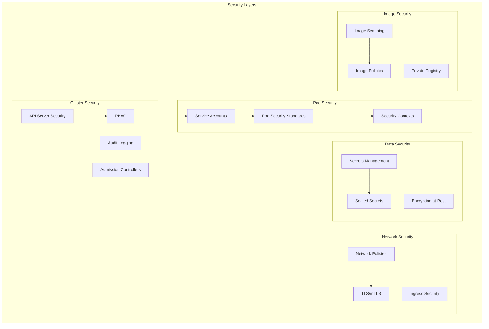

# 07 - Security Best Practices

## Overview

This guide covers comprehensive security best practices for Kubernetes environments, following CKA exam requirements and industry standards. We'll implement defense-in-depth strategies including RBAC, Network Policies, Pod Security Standards, and secrets management.

---

## Security Architecture



### Security Principles

- ✅ **Least Privilege**: Minimal permissions required
- ✅ **Defense in Depth**: Multiple security layers
- ✅ **Zero Trust**: Never trust, always verify
- ✅ **Immutability**: Read-only filesystems
- ✅ **Encryption**: Data at rest and in transit
- ✅ **Auditing**: Comprehensive logging
- ✅ **Automation**: Security as code

---

## 1. RBAC (Role-Based Access Control)

### 1.1 Understanding RBAC Components

**Key Resources:**

- **ServiceAccount**: Identity for pods
- **Role**: Permissions within a namespace
- **ClusterRole**: Cluster-wide permissions
- **RoleBinding**: Binds Role to subjects
- **ClusterRoleBinding**: Binds ClusterRole to subjects

### 1.2 Create Service Accounts

Create `security/serviceaccounts.yaml`:

```yaml
---
# Service Account for demo application
apiVersion: v1
kind: ServiceAccount
metadata:
  name: demo-app
  namespace: demo-app
  labels:
    app: demo-app
automountServiceAccountToken: true
---
# Service Account for Jenkins
apiVersion: v1
kind: ServiceAccount
metadata:
  name: jenkins-deploy
  namespace: jenkins
  labels:
    app: jenkins
automountServiceAccountToken: true
---
# Service Account for monitoring
apiVersion: v1
kind: ServiceAccount
metadata:
  name: prometheus
  namespace: monitoring
  labels:
    app: prometheus
automountServiceAccountToken: true
```

### 1.3 Create Roles

Create `security/roles.yaml`:

```yaml
---
# Role for demo app - minimal permissions
apiVersion: rbac.authorization.k8s.io/v1
kind: Role
metadata:
  name: demo-app-role
  namespace: demo-app
rules:
  # Allow reading ConfigMaps
  - apiGroups: [""]
    resources: ["configmaps"]
    verbs: ["get", "list", "watch"]

  # Allow reading Secrets (specific ones only)
  - apiGroups: [""]
    resources: ["secrets"]
    resourceNames: ["demo-app-secrets"]
    verbs: ["get"]

  # Allow reading own pod info
  - apiGroups: [""]
    resources: ["pods"]
    verbs: ["get", "list"]
---
# Role for Jenkins deployment
apiVersion: rbac.authorization.k8s.io/v1
kind: Role
metadata:
  name: jenkins-deploy-role
  namespace: demo-app
rules:
  # Full control over deployments
  - apiGroups: ["apps"]
    resources: ["deployments", "replicasets"]
    verbs: ["*"]

  # Manage services
  - apiGroups: [""]
    resources: ["services"]
    verbs: ["*"]

  # Manage ConfigMaps and Secrets
  - apiGroups: [""]
    resources: ["configmaps", "secrets"]
    verbs: ["create", "update", "patch", "delete", "get", "list"]

  # Read pods
  - apiGroups: [""]
    resources: ["pods", "pods/log"]
    verbs: ["get", "list", "watch"]
---
# ClusterRole for monitoring
apiVersion: rbac.authorization.k8s.io/v1
kind: ClusterRole
metadata:
  name: prometheus-role
rules:
  # Read all resources for metrics
  - apiGroups: [""]
    resources:
      - nodes
      - nodes/metrics
      - services
      - endpoints
      - pods
    verbs: ["get", "list", "watch"]

  # Read non-resource URLs
  - nonResourceURLs:
      - /metrics
      - /metrics/cadvisor
    verbs: ["get"]

  # Read config
  - apiGroups: [""]
    resources: ["configmaps"]
    verbs: ["get"]
```

### 1.4 Create RoleBindings

Create `security/rolebindings.yaml`:

```yaml
---
# Bind demo app role to service account
apiVersion: rbac.authorization.k8s.io/v1
kind: RoleBinding
metadata:
  name: demo-app-rolebinding
  namespace: demo-app
roleRef:
  apiGroup: rbac.authorization.k8s.io
  kind: Role
  name: demo-app-role
subjects:
  - kind: ServiceAccount
    name: demo-app
    namespace: demo-app
---
# Bind Jenkins deploy role
apiVersion: rbac.authorization.k8s.io/v1
kind: RoleBinding
metadata:
  name: jenkins-deploy-rolebinding
  namespace: demo-app
roleRef:
  apiGroup: rbac.authorization.k8s.io
  kind: Role
  name: jenkins-deploy-role
subjects:
  - kind: ServiceAccount
    name: jenkins-deploy
    namespace: jenkins
---
# Bind Prometheus cluster role
apiVersion: rbac.authorization.k8s.io/v1
kind: ClusterRoleBinding
metadata:
  name: prometheus-clusterrolebinding
roleRef:
  apiGroup: rbac.authorization.k8s.io
  kind: ClusterRole
  name: prometheus-role
subjects:
  - kind: ServiceAccount
    name: prometheus
    namespace: monitoring
```

Apply RBAC:

```bash
kubectl apply -f security/serviceaccounts.yaml
kubectl apply -f security/roles.yaml
kubectl apply -f security/rolebindings.yaml

# Verify
kubectl get sa -A
kubectl get roles -A
kubectl get rolebindings -A
```

### 1.5 Test RBAC Permissions

```bash
# Test as demo-app service account
kubectl auth can-i get configmaps \
  --as=system:serviceaccount:demo-app:demo-app \
  -n demo-app

# Test as Jenkins service account
kubectl auth can-i create deployments \
  --as=system:serviceaccount:jenkins:jenkins-deploy \
  -n demo-app

# List all permissions for a service account
kubectl auth can-i --list \
  --as=system:serviceaccount:demo-app:demo-app \
  -n demo-app
```

---

## 2. Network Policies

### 2.1 Default Deny All Policy

Create `security/networkpolicy-default-deny.yaml`:

```yaml
---
# Deny all ingress traffic by default
apiVersion: networking.k8s.io/v1
kind: NetworkPolicy
metadata:
  name: default-deny-ingress
  namespace: demo-app
spec:
  podSelector: {}
  policyTypes:
    - Ingress
---
# Deny all egress traffic by default
apiVersion: networking.k8s.io/v1
kind: NetworkPolicy
metadata:
  name: default-deny-egress
  namespace: demo-app
spec:
  podSelector: {}
  policyTypes:
    - Egress
```

### 2.2 Allow Specific Traffic

Create `security/networkpolicy-demo-app.yaml`:

```yaml
---
# Allow ingress to demo app from ingress controller
apiVersion: networking.k8s.io/v1
kind: NetworkPolicy
metadata:
  name: demo-app-ingress
  namespace: demo-app
spec:
  podSelector:
    matchLabels:
      app: demo-app
  policyTypes:
    - Ingress
  ingress:
    # Allow from ingress controller
    - from:
        - namespaceSelector:
            matchLabels:
              name: ingress-nginx
      ports:
        - protocol: TCP
          port: 8080

    # Allow from monitoring namespace
    - from:
        - namespaceSelector:
            matchLabels:
              name: monitoring
      ports:
        - protocol: TCP
          port: 8080
---
# Allow egress from demo app
apiVersion: networking.k8s.io/v1
kind: NetworkPolicy
metadata:
  name: demo-app-egress
  namespace: demo-app
spec:
  podSelector:
    matchLabels:
      app: demo-app
  policyTypes:
    - Egress
  egress:
    # Allow DNS
    - to:
        - namespaceSelector:
            matchLabels:
              name: kube-system
      ports:
        - protocol: UDP
          port: 53

    # Allow HTTPS to external services
    - to:
        - namespaceSelector: {}
      ports:
        - protocol: TCP
          port: 443

    # Allow to Kubernetes API
    - to:
        - namespaceSelector: {}
      ports:
        - protocol: TCP
          port: 6443
```

### 2.3 Network Policy for Jenkins

Create `security/networkpolicy-jenkins.yaml`:

```yaml
apiVersion: networking.k8s.io/v1
kind: NetworkPolicy
metadata:
  name: jenkins-network-policy
  namespace: jenkins
spec:
  podSelector:
    matchLabels:
      app.kubernetes.io/name: jenkins
  policyTypes:
    - Ingress
    - Egress
  ingress:
    # Allow from ingress controller
    - from:
        - namespaceSelector:
            matchLabels:
              name: ingress-nginx
      ports:
        - protocol: TCP
          port: 8080

    # Allow from agents
    - from:
        - podSelector:
            matchLabels:
              jenkins: agent
      ports:
        - protocol: TCP
          port: 50000

  egress:
    # Allow all egress (Jenkins needs to access many services)
    - to:
        - namespaceSelector: {}

    # Allow DNS
    - to:
        - namespaceSelector:
            matchLabels:
              name: kube-system
      ports:
        - protocol: UDP
          port: 53
```

Apply Network Policies:

```bash
kubectl apply -f security/networkpolicy-default-deny.yaml
kubectl apply -f security/networkpolicy-demo-app.yaml
kubectl apply -f security/networkpolicy-jenkins.yaml

# Verify
kubectl get networkpolicies -A
kubectl describe networkpolicy demo-app-ingress -n demo-app
```

### 2.4 Test Network Policies

```bash
# Test connectivity from a test pod
kubectl run test-pod --image=busybox -n demo-app -- sleep 3600

# Test allowed connection
kubectl exec -n demo-app test-pod -- wget -O- http://demo-app:80

# Test blocked connection (should fail)
kubectl exec -n demo-app test-pod -- wget -O- http://external-service:80

# Clean up
kubectl delete pod test-pod -n demo-app
```

---

## 3. Pod Security Standards

### 3.1 Pod Security Admission

Enable Pod Security Standards for namespaces:

```bash
# Enforce restricted policy
kubectl label namespace demo-app \
  pod-security.kubernetes.io/enforce=restricted \
  pod-security.kubernetes.io/audit=restricted \
  pod-security.kubernetes.io/warn=restricted

# Enforce baseline for jenkins
kubectl label namespace jenkins \
  pod-security.kubernetes.io/enforce=baseline \
  pod-security.kubernetes.io/audit=restricted \
  pod-security.kubernetes.io/warn=restricted

# Verify
kubectl get namespace demo-app -o yaml | grep pod-security
```

### 3.2 Secure Pod Configuration

Create `security/secure-pod.yaml`:

```yaml
apiVersion: v1
kind: Pod
metadata:
  name: secure-pod
  namespace: demo-app
spec:
  # Use specific service account
  serviceAccountName: demo-app
  automountServiceAccountToken: true

  # Security context for pod
  securityContext:
    runAsNonRoot: true
    runAsUser: 65534
    runAsGroup: 65534
    fsGroup: 65534
    seccompProfile:
      type: RuntimeDefault

  containers:
    - name: app
      image: your-username/demo-app:latest

      # Security context for container
      securityContext:
        allowPrivilegeEscalation: false
        readOnlyRootFilesystem: true
        runAsNonRoot: true
        runAsUser: 65534
        capabilities:
          drop:
            - ALL
          add:
            - NET_BIND_SERVICE  # Only if needed

      # Resource limits
      resources:
        requests:
          cpu: 100m
          memory: 128Mi
        limits:
          cpu: 500m
          memory: 512Mi

      # Volume mounts for writable directories
      volumeMounts:
        - name: tmp
          mountPath: /tmp
        - name: cache
          mountPath: /app/cache

  volumes:
    - name: tmp
      emptyDir: {}
    - name: cache
      emptyDir: {}
```

### 3.3 Security Context Examples

```yaml
# Minimal security context
securityContext:
  runAsNonRoot: true
  runAsUser: 1000
  capabilities:
    drop:
      - ALL

# Strict security context
securityContext:
  allowPrivilegeEscalation: false
  readOnlyRootFilesystem: true
  runAsNonRoot: true
  runAsUser: 65534
  capabilities:
    drop:
      - ALL
  seccompProfile:
    type: RuntimeDefault
```

---

## 4. Secrets Management

### 4.1 Create Kubernetes Secrets

```bash
# Create generic secret
kubectl create secret generic demo-app-secrets \
  --from-literal=database-password='' \
  --from-literal=api-key='api-key-value' \
  -n demo-app

# Create TLS secret
kubectl create secret tls demo-app-tls \
  --cert=path/to/cert.crt \
  --key=path/to/cert.key \
  -n demo-app

# Create Docker registry secret
kubectl create secret docker-registry regcred \
  --docker-server=docker.io \
  --docker-username=your-username \
  --docker-password=your-password \
  --docker-email=your-email \
  -n demo-app
```

### 4.2 Use Secrets in Pods

```yaml
apiVersion: v1
kind: Pod
metadata:
  name: secret-pod
spec:
  containers:
    - name: app
      image: your-app

      # Environment variables from secret
      env:
        - name: DATABASE_PASSWORD
          valueFrom:
            secretKeyRef:
              name: demo-app-secrets
              key: database-password

      # Mount secret as volume
      volumeMounts:
        - name: secret-volume
          mountPath: /etc/secrets
          readOnly: true

  volumes:
    - name: secret-volume
      secret:
        secretName: demo-app-secrets
        defaultMode: 0400
```

### 4.3 Install Sealed Secrets

```bash
# Install Sealed Secrets controller
kubectl apply -f https://github.com/bitnami-labs/sealed-secrets/releases/download/v0.24.0/controller.yaml

# Install kubeseal CLI
brew install kubeseal

# Or download binary
KUBESEAL_VERSION='0.24.0'
wget "https://github.com/bitnami-labs/sealed-secrets/releases/download/v${KUBESEAL_VERSION}/kubeseal-${KUBESEAL_VERSION}-darwin-amd64.tar.gz"
tar -xvzf kubeseal-${KUBESEAL_VERSION}-darwin-amd64.tar.gz kubeseal
sudo install -m 755 kubeseal /usr/local/bin/kubeseal
```

### 4.4 Create Sealed Secrets

```bash
# Create a secret (don't apply yet)
kubectl create secret generic mysecret \
  --from-literal=password=mypassword \
  --dry-run=client \
  -o yaml > secret.yaml

# Seal the secret
kubeseal -f secret.yaml -w sealed-secret.yaml

# Apply sealed secret (safe to commit to Git)
kubectl apply -f sealed-secret.yaml

# The controller will decrypt it automatically
kubectl get secret mysecret -o yaml
```

Create `security/sealed-secret.yaml`:

```yaml
apiVersion: bitnami.com/v1alpha1
kind: SealedSecret
metadata:
  name: demo-app-secrets
  namespace: demo-app
spec:
  encryptedData:
    database-password: AgBx8F7... # Encrypted value
    api-key: AgCy9G8... # Encrypted value
  template:
    metadata:
      name: demo-app-secrets
      namespace: demo-app
    type: Opaque
```

---

## 5. Image Security

### 5.1 Image Scanning with Trivy

```bash
# Install Trivy
brew install trivy

# Scan image
trivy image your-username/demo-app:latest

# Scan with severity filter
trivy image --severity HIGH,CRITICAL your-username/demo-app:latest

# Scan and fail on vulnerabilities
trivy image --exit-code 1 --severity CRITICAL your-username/demo-app:latest

# Generate report
trivy image --format json --output report.json your-username/demo-app:latest
```

### 5.2 Image Policy with OPA Gatekeeper

Install Gatekeeper:

```bash
kubectl apply -f https://raw.githubusercontent.com/open-policy-agent/gatekeeper/master/deploy/gatekeeper.yaml
```

Create image policy:

```yaml
apiVersion: templates.gatekeeper.sh/v1
kind: ConstraintTemplate
metadata:
  name: k8sallowedrepos
spec:
  crd:
    spec:
      names:
        kind: K8sAllowedRepos
      validation:
        openAPIV3Schema:
          type: object
          properties:
            repos:
              type: array
              items:
                type: string
  targets:
    - target: admission.k8s.gatekeeper.sh
      rego: |
        package k8sallowedrepos

        violation[{"msg": msg}] {
          container := input.review.object.spec.containers[_]
          not startswith(container.image, input.parameters.repos[_])
          msg := sprintf("container <%v> has an invalid image repo <%v>", [container.name, container.image])
        }
---
apiVersion: constraints.gatekeeper.sh/v1beta1
kind: K8sAllowedRepos
metadata:
  name: allowed-repos
spec:
  match:
    kinds:
      - apiGroups: [""]
        kinds: ["Pod"]
    namespaces:
      - demo-app
  parameters:
    repos:
      - "docker.io/your-username/"
      - "gcr.io/your-project/"
```

### 5.3 Private Registry Configuration

```bash
# Create image pull secret
kubectl create secret docker-registry private-registry \
  --docker-server=registry.example.com \
  --docker-username=username \
  --docker-password=password \
  --docker-email=email@example.com \
  -n demo-app

# Use in pod
kubectl patch serviceaccount demo-app \
  -n demo-app \
  -p '{"imagePullSecrets": [{"name": "private-registry"}]}'
```

---

## 6. TLS and Certificate Management

### 6.1 Install cert-manager

```bash
# Install cert-manager
kubectl apply -f https://github.com/cert-manager/cert-manager/releases/download/v1.13.0/cert-manager.yaml

# Verify installation
kubectl get pods -n cert-manager
```

### 6.2 Create ClusterIssuer

Create `security/cluster-issuer.yaml`:

```yaml
---
# Self-signed issuer for development
apiVersion: cert-manager.io/v1
kind: ClusterIssuer
metadata:
  name: selfsigned-issuer
spec:
  selfSigned: {}
---
# Let's Encrypt issuer for production
apiVersion: cert-manager.io/v1
kind: ClusterIssuer
metadata:
  name: letsencrypt-prod
spec:
  acme:
    server: https://acme-v02.api.letsencrypt.org/directory
    email: your-email@example.com
    privateKeySecretRef:
      name: letsencrypt-prod
    solvers:
      - http01:
          ingress:
            class: nginx
```

### 6.3 Create Certificate

Create `security/certificate.yaml`:

```yaml
apiVersion: cert-manager.io/v1
kind: Certificate
metadata:
  name: demo-app-tls
  namespace: demo-app
spec:
  secretName: demo-app-tls-secret
  issuerRef:
    name: selfsigned-issuer
    kind: ClusterIssuer
  dnsNames:
    - demo-app.local
    - www.demo-app.local
```

### 6.4 Use Certificate in Ingress

```yaml
apiVersion: networking.k8s.io/v1
kind: Ingress
metadata:
  name: demo-app-ingress
  namespace: demo-app
  annotations:
    cert-manager.io/cluster-issuer: selfsigned-issuer
spec:
  tls:
    - hosts:
        - demo-app.local
      secretName: demo-app-tls-secret
  rules:
    - host: demo-app.local
      http:
        paths:
          - path: /
            pathType: Prefix
            backend:
              service:
                name: demo-app
                port:
                  number: 80
```

---

## 7. Audit Logging

### 7.1 Enable Audit Logging

For Minikube, audit logging is limited. For production clusters:

Create `security/audit-policy.yaml`:

```yaml
apiVersion: audit.k8s.io/v1
kind: Policy
rules:
  # Log all requests at Metadata level
  - level: Metadata
    omitStages:
      - RequestReceived

  # Log pod changes at Request level
  - level: Request
    resources:
      - group: ""
        resources: ["pods"]
    verbs: ["create", "update", "patch", "delete"]

  # Log secret access
  - level: Metadata
    resources:
      - group: ""
        resources: ["secrets"]

  # Don't log read-only requests
  - level: None
    verbs: ["get", "list", "watch"]
```

### 7.2 Query Audit Logs

```bash
# View audit logs (if enabled)
kubectl logs -n kube-system kube-apiserver-minikube | grep audit

# Filter for specific user
kubectl logs -n kube-system kube-apiserver-minikube | grep "user.username"

# Filter for specific resource
kubectl logs -n kube-system kube-apiserver-minikube | grep "pods"
```

---

## 8. Security Scanning and Compliance

### 8.1 Install kube-bench

```bash
# Run kube-bench as a job
kubectl apply -f https://raw.githubusercontent.com/aquasecurity/kube-bench/main/job.yaml

# View results
kubectl logs -f job/kube-bench

# Or run locally
docker run --rm -v `pwd`:/host aquasec/kube-bench:latest
```

### 8.2 Install kube-hunter

```bash
# Run kube-hunter
kubectl apply -f https://raw.githubusercontent.com/aquasecurity/kube-hunter/main/job.yaml

# View results
kubectl logs -f job/kube-hunter
```

### 8.3 Install Falco (Runtime Security)

```bash
# Add Falco Helm repository
helm repo add falcosecurity https://falcosecurity.github.io/charts
helm repo update

# Install Falco
helm install falco falcosecurity/falco \
  --namespace falco \
  --create-namespace

# View Falco alerts
kubectl logs -n falco -l app=falco -f
```

---

## 9. Security Checklist

### 9.1 Cluster Security

- [ ] RBAC enabled and configured
- [ ] Service accounts with minimal permissions
- [ ] Network policies implemented
- [ ] Pod Security Standards enforced
- [ ] Audit logging enabled
- [ ] API server secured
- [ ] etcd encrypted
- [ ] Admission controllers configured

### 9.2 Workload Security

- [ ] Non-root containers
- [ ] Read-only root filesystem
- [ ] No privileged containers
- [ ] Resource limits set
- [ ] Security contexts configured
- [ ] Secrets not in environment variables
- [ ] Image scanning implemented
- [ ] Private registry used

### 9.3 Network Security

- [ ] Network policies enforced
- [ ] TLS for all services
- [ ] Ingress properly configured
- [ ] Service mesh (optional)
- [ ] mTLS between services

### 9.4 Data Security

- [ ] Secrets encrypted at rest
- [ ] Sealed Secrets for GitOps
- [ ] Backup encryption
- [ ] PV encryption
- [ ] Database encryption

---

## 10. Security Automation

### 10.1 Security Scanning in CI/CD

Add to Jenkinsfile:

```groovy
stage('Security Scan') {
    parallel {
        stage('Image Scan') {
            steps {
                sh 'trivy image --severity HIGH,CRITICAL ${DOCKER_IMAGE}'
            }
        }
        stage('Manifest Scan') {
            steps {
                sh 'kubesec scan k8s/*.yaml'
            }
        }
        stage('Secret Scan') {
            steps {
                sh 'gitleaks detect --source . --verbose'
            }
        }
    }
}
```

### 10.2 Automated Compliance Checks

Create `scripts/security-check.sh`:

```bash
#!/bin/bash
set -e

echo "🔒 Running security checks..."

# Check RBAC
echo "Checking RBAC..."
kubectl auth can-i --list --as=system:serviceaccount:demo-app:demo-app

# Check Network Policies
echo "Checking Network Policies..."
kubectl get networkpolicies -A

# Check Pod Security
echo "Checking Pod Security..."
kubectl get pods -A -o jsonpath='{range .items[*]}{.metadata.name}{"\t"}{.spec.securityContext}{"\n"}{end}'

# Check for privileged pods
echo "Checking for privileged pods..."
kubectl get pods -A -o json | jq '.items[] | select(.spec.containers[].securityContext.privileged==true) | .metadata.name'

# Check for pods running as root
echo "Checking for pods running as root..."
kubectl get pods -A -o json | jq '.items[] | select(.spec.securityContext.runAsUser==0 or .spec.containers[].securityContext.runAsUser==0) | .metadata.name'

echo "✅ Security checks complete!"
```

---

## 11. Incident Response

### 11.1 Security Incident Playbook

1. **Detect**: Monitor alerts from Falco, Prometheus
2. **Isolate**: Apply network policy to isolate affected pods
3. **Investigate**: Check logs, audit logs, metrics
4. **Remediate**: Patch vulnerability, update image
5. **Recover**: Redeploy from known good state
6. **Review**: Post-incident review and improvements

### 11.2 Emergency Procedures

```bash
# Isolate a compromised pod
kubectl label pod <pod-name> quarantine=true -n <namespace>

# Apply restrictive network policy
kubectl apply -f - <<EOF
apiVersion: networking.k8s.io/v1
kind: NetworkPolicy
metadata:
  name: quarantine
  namespace: <namespace>
spec:
  podSelector:
    matchLabels:
      quarantine: "true"
  policyTypes:
    - Ingress
    - Egress
EOF

# Collect forensics
kubectl logs <pod-name> -n <namespace> > pod-logs.txt
kubectl describe pod <pod-name> -n <namespace> > pod-describe.txt
kubectl get events -n <namespace> > events.txt

# Delete compromised pod
kubectl delete pod <pod-name> -n <namespace>
```

---

## 12. Useful Commands

```bash
# RBAC
kubectl auth can-i create pods --as=system:serviceaccount:demo-app:demo-app
kubectl get roles,rolebindings -A
kubectl describe role <role-name> -n <namespace>

# Network Policies
kubectl get networkpolicies -A
kubectl describe networkpolicy <policy-name> -n <namespace>

# Secrets
kubectl get secrets -A
kubectl describe secret <secret-name> -n <namespace>

# Security Context
kubectl get pod <pod-name> -n <namespace> -o jsonpath='{.spec.securityContext}'

# Image scanning
trivy image <image-name>
trivy k8s --report summary cluster

# Audit
kubectl get events -A --sort-by='.lastTimestamp'
```

---

## 13. Next Steps

Now that security is configured, proceed to:

- **[08-additional-tools.md](./08-additional-tools.md)** - Install and configure additional Kubernetes tools

---

## Additional Resources

- [Kubernetes Security Best Practices](https://kubernetes.io/docs/concepts/security/)
- [CIS Kubernetes Benchmark](https://www.cisecurity.org/benchmark/kubernetes)
- [NIST Kubernetes Security Guide](https://nvlpubs.nist.gov/nistpubs/SpecialPublications/NIST.SP.800-190.pdf)
- [Pod Security Standards](https://kubernetes.io/docs/concepts/security/pod-security-standards/)
- [Network Policies](https://kubernetes.io/docs/concepts/services-networking/network-policies/)
- [RBAC Documentation](https://kubernetes.io/docs/reference/access-authn-authz/rbac/)
