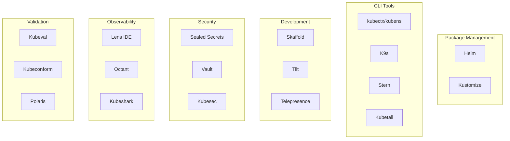

# 08 - Additional Kubernetes Tools

## Overview

This guide covers essential Kubernetes tools that enhance productivity, simplify operations, and improve the development experience. These tools are commonly used in production environments and are valuable for CKA exam preparation.

---

## Tools Overview



---

## 1. Helm - Kubernetes Package Manager

### 1.1 Install Helm

```bash
# Install via Homebrew (macOS)
brew install helm

# Verify installation
helm version

# Expected output:
# version.BuildInfo{Version:"v3.13.x"}
```

### 1.2 Helm Basics

```bash
# Add repository
helm repo add bitnami https://charts.bitnami.com/bitnami
helm repo update

# Search for charts
helm search repo nginx

# Install chart
helm install my-nginx bitnami/nginx --namespace default

# List releases
helm list -A

# Get release info
helm get all my-nginx

# Upgrade release
helm upgrade my-nginx bitnami/nginx --set replicaCount=3

# Rollback release
helm rollback my-nginx 1

# Uninstall release
helm uninstall my-nginx
```

### 1.3 Create Custom Helm Chart

```bash
# Create new chart
helm create my-app

# Chart structure:
# my-app/
# ├── Chart.yaml          # Chart metadata
# ├── values.yaml         # Default values
# ├── charts/             # Dependencies
# └── templates/          # Kubernetes manifests
#     ├── deployment.yaml
#     ├── service.yaml
#     ├── ingress.yaml
#     └── _helpers.tpl    # Template helpers
```

Create `my-app/Chart.yaml`:

```yaml
apiVersion: v2
name: my-app
description: A Helm chart for my application
type: application
version: 1.0.0
appVersion: "1.0.0"
keywords:
  - demo
  - application
maintainers:
  - name: Your Name
    email: your-email@example.com
```

Create `my-app/values.yaml`:

```yaml
replicaCount: 2

image:
  repository: your-username/demo-app
  pullPolicy: IfNotPresent
  tag: "latest"

service:
  type: ClusterIP
  port: 80
  targetPort: 8080

ingress:
  enabled: true
  className: nginx
  annotations: {}
  hosts:
    - host: demo-app.local
      paths:
        - path: /
          pathType: Prefix
  tls: []

resources:
  limits:
    cpu: 500m
    memory: 512Mi
  requests:
    cpu: 100m
    memory: 128Mi

autoscaling:
  enabled: false
  minReplicas: 2
  maxReplicas: 10
  targetCPUUtilizationPercentage: 80
```

### 1.4 Helm Commands Reference

```bash
# Template rendering (dry-run)
helm template my-app ./my-app

# Install with custom values
helm install my-app ./my-app -f custom-values.yaml

# Install with inline values
helm install my-app ./my-app --set replicaCount=3

# Upgrade with values
helm upgrade my-app ./my-app --set image.tag=v2.0.0

# Show values
helm get values my-app

# Show manifest
helm get manifest my-app

# History
helm history my-app

# Package chart
helm package my-app

# Lint chart
helm lint my-app

# Test release
helm test my-app
```

---

## 2. Kustomize - Configuration Management

### 2.1 Install Kustomize

```bash
# Install via Homebrew
brew install kustomize

# Verify installation
kustomize version

# Note: kubectl has built-in kustomize support
kubectl kustomize --help
```

### 2.2 Kustomize Structure

```
k8s/
├── base/
│   ├── deployment.yaml
│   ├── service.yaml
│   └── kustomization.yaml
└── overlays/
    ├── dev/
    │   ├── kustomization.yaml
    │   └── patches/
    ├── staging/
    │   ├── kustomization.yaml
    │   └── patches/
    └── prod/
        ├── kustomization.yaml
        └── patches/
```

### 2.3 Base Configuration

Create `k8s/base/kustomization.yaml`:

```yaml
apiVersion: kustomize.config.k8s.io/v1beta1
kind: Kustomization

resources:
  - deployment.yaml
  - service.yaml

commonLabels:
  app: demo-app
  managed-by: kustomize

images:
  - name: demo-app
    newName: your-username/demo-app
    newTag: latest

configMapGenerator:
  - name: app-config
    literals:
      - APP_ENV=base
      - LOG_LEVEL=info
```

### 2.4 Environment Overlays

Create `k8s/overlays/dev/kustomization.yaml`:

```yaml
apiVersion: kustomize.config.k8s.io/v1beta1
kind: Kustomization

namespace: demo-app-dev

bases:
  - ../../base

namePrefix: dev-

commonLabels:
  environment: development

replicas:
  - name: demo-app
    count: 1

images:
  - name: demo-app
    newTag: dev-latest

configMapGenerator:
  - name: app-config
    behavior: merge
    literals:
      - APP_ENV=development
      - LOG_LEVEL=debug

patchesStrategicMerge:
  - patches/deployment-patch.yaml
```

Create `k8s/overlays/dev/patches/deployment-patch.yaml`:

```yaml
apiVersion: apps/v1
kind: Deployment
metadata:
  name: demo-app
spec:
  template:
    spec:
      containers:
        - name: demo-app
          resources:
            requests:
              cpu: 50m
              memory: 64Mi
            limits:
              cpu: 200m
              memory: 256Mi
```

### 2.5 Kustomize Commands

```bash
# Build manifests
kustomize build k8s/overlays/dev

# Apply with kubectl
kubectl apply -k k8s/overlays/dev

# Diff before apply
kubectl diff -k k8s/overlays/dev

# Delete resources
kubectl delete -k k8s/overlays/dev

# View resources
kubectl kustomize k8s/overlays/dev
```

---

## 3. kubectx and kubens - Context Switching

### 3.1 Install kubectx/kubens

```bash
# Install via Homebrew
brew install kubectx

# Verify installation
kubectx --version
kubens --version
```

### 3.2 kubectx Usage

```bash
# List contexts
kubectx

# Switch context
kubectx minikube

# Switch to previous context
kubectx -

# Rename context
kubectx new-name=old-name

# Delete context
kubectx -d context-name

# Show current context
kubectx -c
```

### 3.3 kubens Usage

```bash
# List namespaces
kubens

# Switch namespace
kubens demo-app

# Switch to previous namespace
kubens -

# Show current namespace
kubens -c
```

### 3.4 Create Aliases

Add to `~/.bashrc` or `~/.zshrc`:

```bash
# kubectx aliases
alias kctx='kubectx'
alias kns='kubens'

# Quick context switches
alias kdev='kubectx dev-cluster'
alias kprod='kubectx prod-cluster'

# Quick namespace switches
alias kdefault='kubens default'
alias kdemo='kubens demo-app'
```

---

## 4. K9s - Terminal UI

### 4.1 Install K9s

```bash
# Install via Homebrew
brew install k9s

# Verify installation
k9s version
```

### 4.2 K9s Usage

```bash
# Launch K9s
k9s

# Launch in specific namespace
k9s -n demo-app

# Launch with specific context
k9s --context minikube

# Launch in readonly mode
k9s --readonly
```

### 4.3 K9s Keyboard Shortcuts

```
# Navigation
:pods          # View pods
:deployments   # View deployments
:services      # View services
:namespaces    # View namespaces
:nodes         # View nodes

# Actions
d              # Describe resource
l              # View logs
e              # Edit resource
y              # View YAML
ctrl-d         # Delete resource
s              # Shell into pod
p              # Port forward

# Filtering
/              # Filter resources
esc            # Clear filter

# Other
?              # Help
:q or ctrl-c   # Quit
```

### 4.4 K9s Configuration

Create `~/.k9s/config.yml`:

```yaml
k9s:
  refreshRate: 2
  maxConnRetry: 5
  readOnly: false
  noExitOnCtrlC: false
  ui:
    enableMouse: true
    headless: false
    logoless: false
    crumbsless: false
    noIcons: false
  skipLatestRevCheck: false
  disablePodCounting: false
  shellPod:
    image: busybox:1.35.0
    command: []
    args: []
    namespace: default
    limits:
      cpu: 100m
      memory: 100Mi
  imageScans:
    enable: false
    exclusions:
      namespaces: []
      labels: {}
  logger:
    tail: 100
    buffer: 5000
    sinceSeconds: -1
    fullScreenLogs: false
    textWrap: false
    showTime: false
```

---

## 5. Stern - Multi-Pod Log Tailing

### 5.1 Install Stern

```bash
# Install via Homebrew
brew install stern

# Verify installation
stern --version
```

### 5.2 Stern Usage

```bash
# Tail logs from all pods matching pattern
stern demo-app

# Tail logs from specific namespace
stern demo-app -n demo-app

# Tail logs with timestamp
stern demo-app --timestamps

# Tail logs since duration
stern demo-app --since 1h

# Tail logs with context
stern demo-app --context 5

# Tail logs from multiple namespaces
stern demo-app --all-namespaces

# Tail logs with color
stern demo-app --color always

# Tail logs from specific container
stern demo-app --container app

# Exclude pods
stern demo-app --exclude "test.*"

# Output as JSON
stern demo-app --output json

# Follow logs
stern demo-app --tail 10 -f
```

### 5.3 Stern with Grep

```bash
# Filter logs
stern demo-app | grep ERROR

# Filter with multiple patterns
stern demo-app | grep -E "ERROR|WARN"

# Exclude patterns
stern demo-app | grep -v DEBUG

# Count occurrences
stern demo-app | grep ERROR | wc -l
```

---

## 6. Sealed Secrets - GitOps Secrets

### 6.1 Install Sealed Secrets

```bash
# Install controller
kubectl apply -f https://github.com/bitnami-labs/sealed-secrets/releases/download/v0.24.0/controller.yaml

# Install kubeseal CLI
brew install kubeseal

# Verify installation
kubeseal --version
```

### 6.2 Create Sealed Secrets

```bash
# Create a secret (don't apply)
kubectl create secret generic mysecret \
  --from-literal=username=admin \
  --from-literal=password=secret123 \
  --dry-run=client \
  -o yaml > secret.yaml

# Seal the secret
kubeseal -f secret.yaml -w sealed-secret.yaml

# Apply sealed secret (safe to commit)
kubectl apply -f sealed-secret.yaml

# Verify secret was created
kubectl get secret mysecret -o yaml
```

### 6.3 Sealed Secret from File

```bash
# Create secret from file
kubectl create secret generic app-config \
  --from-file=config.json \
  --dry-run=client \
  -o yaml | kubeseal -o yaml > sealed-config.yaml

# Apply
kubectl apply -f sealed-config.yaml
```

### 6.4 Backup Sealed Secrets Key

```bash
# Backup the encryption key
kubectl get secret -n kube-system sealed-secrets-key -o yaml > sealed-secrets-key-backup.yaml

# Store securely (DO NOT commit to Git)
# Restore on new cluster:
kubectl apply -f sealed-secrets-key-backup.yaml
kubectl delete pod -n kube-system -l name=sealed-secrets-controller
```

---

## 7. Lens - Kubernetes IDE

### 7.1 Install Lens

```bash
# Download from https://k8slens.dev/
# Or install via Homebrew
brew install --cask lens

# Launch Lens
open -a Lens
```

### 7.2 Lens Features

- **Cluster Management**: Multiple cluster support
- **Resource Viewing**: Browse all Kubernetes resources
- **Logs**: Real-time log streaming
- **Terminal**: Built-in terminal
- **Metrics**: Resource usage graphs
- **Helm**: Chart management
- **Extensions**: Plugin ecosystem

### 7.3 Lens Extensions

Popular extensions:

- **@alebcay/openlens-node-pod-menu**: Enhanced node/pod menus
- **@nevalla/kube-resource-map**: Resource relationship visualization
- **@lens-extension/metrics-cluster-feature**: Enhanced metrics

---

## 8. Validation Tools

### 8.1 Kubeval - Manifest Validation

```bash
# Install kubeval
brew install kubeval

# Validate single file
kubeval deployment.yaml

# Validate directory
kubeval k8s/*.yaml

# Validate with specific Kubernetes version
kubeval --kubernetes-version 1.28.0 deployment.yaml

# Ignore missing schemas
kubeval --ignore-missing-schemas deployment.yaml

# Output as JSON
kubeval --output json deployment.yaml
```

### 8.2 Kubeconform - Fast Validation

```bash
# Install kubeconform
brew install kubeconform

# Validate files
kubeconform k8s/*.yaml

# Validate with strict mode
kubeconform -strict k8s/*.yaml

# Validate with specific Kubernetes version
kubeconform -kubernetes-version 1.28.0 k8s/*.yaml

# Validate Kustomize output
kustomize build k8s/overlays/dev | kubeconform -stdin

# Summary output
kubeconform -summary k8s/*.yaml
```

### 8.3 Polaris - Best Practices

```bash
# Install Polaris
kubectl apply -f https://github.com/FairwindsOps/polaris/releases/latest/download/dashboard.yaml

# Access dashboard
kubectl port-forward -n polaris svc/polaris-dashboard 8080:80

# Or run as CLI
brew install fairwinds/tap/polaris

# Audit cluster
polaris audit --format=pretty

# Audit specific namespace
polaris audit --namespace demo-app

# Generate report
polaris audit --format=json > polaris-report.json
```

---

## 9. Development Tools

### 9.1 Skaffold - Local Development

```bash
# Install Skaffold
brew install skaffold

# Initialize Skaffold
skaffold init

# Run in dev mode (auto-rebuild on changes)
skaffold dev

# Build and deploy
skaffold run

# Delete deployed resources
skaffold delete

# Debug
skaffold debug
```

Create `skaffold.yaml`:

```yaml
apiVersion: skaffold/v4beta6
kind: Config
metadata:
  name: demo-app
build:
  artifacts:
    - image: your-username/demo-app
      docker:
        dockerfile: Dockerfile
deploy:
  kubectl:
    manifests:
      - k8s/overlays/dev/*.yaml
portForward:
  - resourceType: service
    resourceName: demo-app
    port: 80
    localPort: 8080
```

### 9.2 Telepresence - Local Development

```bash
# Install Telepresence
brew install datawire/blackbird/telepresence

# Connect to cluster
telepresence connect

# Intercept service
telepresence intercept demo-app --port 8080:80

# Run local service
./demo-app

# Leave intercept
telepresence leave demo-app

# Quit
telepresence quit
```

---

## 10. Debugging Tools

### 10.1 kubectl-debug

```bash
# Install kubectl-debug
kubectl krew install debug

# Debug a pod
kubectl debug pod-name -it --image=busybox

# Debug with specific image
kubectl debug pod-name -it --image=nicolaka/netshoot

# Debug node
kubectl debug node/node-name -it --image=ubuntu
```

### 10.2 Kubeshark - Network Traffic

```bash
# Install Kubeshark
brew install kubeshark

# Start capturing
kubeshark tap

# Capture specific namespace
kubeshark tap -n demo-app

# Access dashboard
# Opens automatically at http://localhost:8899
```

---

## 11. Productivity Aliases

Add to `~/.bashrc` or `~/.zshrc`:

```bash
# kubectl aliases
alias k='kubectl'
alias kg='kubectl get'
alias kd='kubectl describe'
alias kdel='kubectl delete'
alias kl='kubectl logs'
alias kex='kubectl exec -it'
alias kap='kubectl apply -f'
alias kgp='kubectl get pods'
alias kgs='kubectl get svc'
alias kgd='kubectl get deployments'
alias kgn='kubectl get nodes'

# Namespace aliases
alias kn='kubectl config set-context --current --namespace'

# Watch aliases
alias kgpw='kubectl get pods -w'
alias kgdw='kubectl get deployments -w'

# Logs aliases
alias klf='kubectl logs -f'
alias klp='kubectl logs -p'

# Context aliases
alias kctx='kubectl config use-context'
alias kcurrent='kubectl config current-context'

# Describe aliases
alias kdp='kubectl describe pod'
alias kdd='kubectl describe deployment'
alias kds='kubectl describe service'

# Edit aliases
alias kep='kubectl edit pod'
alias ked='kubectl edit deployment'
alias kes='kubectl edit service'

# Port forward aliases
alias kpf='kubectl port-forward'

# Top aliases
alias ktop='kubectl top'
alias ktopn='kubectl top nodes'
alias ktopp='kubectl top pods'

# Kustomize aliases
alias kk='kubectl kustomize'
alias kka='kubectl apply -k'
alias kkd='kubectl delete -k'

# Helm aliases
alias h='helm'
alias hi='helm install'
alias hu='helm upgrade'
alias hls='helm list'
alias hun='helm uninstall'
```

---

## 12. Shell Completion

### 12.1 kubectl Completion

```bash
# Bash
echo 'source <(kubectl completion bash)' >> ~/.bashrc
echo 'alias k=kubectl' >> ~/.bashrc
echo 'complete -F __start_kubectl k' >> ~/.bashrc

# Zsh
echo 'source <(kubectl completion zsh)' >> ~/.zshrc
echo 'alias k=kubectl' >> ~/.zshrc
echo 'compdef __start_kubectl k' >> ~/.zshrc

# Reload shell
source ~/.bashrc  # or ~/.zshrc
```

### 12.2 Helm Completion

```bash
# Bash
helm completion bash > /usr/local/etc/bash_completion.d/helm

# Zsh
helm completion zsh > "${fpath[1]}/_helm"
```

---

## 13. Tool Comparison

| Tool | Purpose | Best For |
|------|---------|----------|
| **Helm** | Package management | Complex applications, versioning |
| **Kustomize** | Configuration management | Environment-specific configs |
| **K9s** | Terminal UI | Quick cluster navigation |
| **Lens** | Desktop IDE | Visual cluster management |
| **Stern** | Log aggregation | Multi-pod log viewing |
| **kubectx/kubens** | Context switching | Multiple clusters/namespaces |
| **Skaffold** | Development workflow | Local development |
| **Telepresence** | Local debugging | Service intercept |

---

## 14. Useful Commands Reference

```bash
# Helm
helm repo add <name> <url>
helm install <release> <chart>
helm upgrade <release> <chart>
helm rollback <release> <revision>
helm uninstall <release>

# Kustomize
kubectl apply -k <directory>
kubectl kustomize <directory>
kustomize build <directory>

# K9s
k9s
k9s -n <namespace>
k9s --readonly

# Stern
stern <pod-pattern>
stern <pod-pattern> -n <namespace>
stern <pod-pattern> --timestamps

# kubectx/kubens
kubectx <context>
kubens <namespace>

# Sealed Secrets
kubeseal -f <secret.yaml> -w <sealed-secret.yaml>
kubectl apply -f <sealed-secret.yaml>

# Validation
kubeval <file.yaml>
kubeconform <file.yaml>
polaris audit
```

---

## 15. Next Steps

Now that additional tools are configured, proceed to:

- **[09-troubleshooting.md](./09-troubleshooting.md)** - Learn troubleshooting techniques

---

## Additional Resources

- [Helm Documentation](https://helm.sh/docs/)
- [Kustomize Documentation](https://kustomize.io/)
- [K9s Documentation](https://k9scli.io/)
- [Stern GitHub](https://github.com/stern/stern)
- [Sealed Secrets](https://github.com/bitnami-labs/sealed-secrets)
- [Lens Documentation](https://docs.k8slens.dev/)
- [kubectl Cheat Sheet](https://kubernetes.io/docs/reference/kubectl/cheatsheet/)
