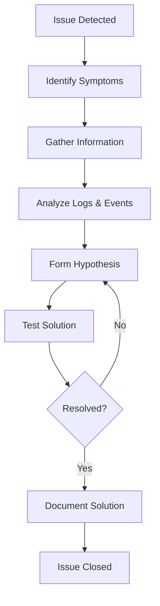

# 09 - Troubleshooting Guide

## Overview

This comprehensive troubleshooting guide covers common Kubernetes issues, debugging techniques, and resolution strategies. Essential for CKA exam preparation and production operations.

---

## Troubleshooting Methodology



### Troubleshooting Steps

1. **Identify**: What is the symptom?
2. **Gather**: Collect logs, events, metrics
3. **Analyze**: Review data for patterns
4. **Hypothesize**: Form potential causes
5. **Test**: Try solutions
6. **Verify**: Confirm resolution
7. **Document**: Record for future reference

---

## 1. Pod Issues

### 1.1 Pod Not Starting

**Symptoms:**

- Pod stuck in `Pending`, `ContainerCreating`, or `CrashLoopBackOff`

**Diagnosis:**

```bash
# Check pod status
kubectl get pods -n <namespace>

# Describe pod for events
kubectl describe pod <pod-name> -n <namespace>

# Check pod logs
kubectl logs <pod-name> -n <namespace>

# Check previous container logs (if crashed)
kubectl logs <pod-name> -n <namespace> --previous

# Check events
kubectl get events -n <namespace> --sort-by='.lastTimestamp'
```

**Common Causes & Solutions:**

#### Image Pull Errors

```bash
# Error: ImagePullBackOff, ErrImagePull

# Check image name
kubectl get pod <pod-name> -n <namespace> -o jsonpath='{.spec.containers[*].image}'

# Verify image exists
docker pull <image-name>

# Check image pull secrets
kubectl get secrets -n <namespace>

# Create image pull secret
kubectl create secret docker-registry regcred \
  --docker-server=<registry> \
  --docker-username=<username> \
  --docker-password=<password> \
  -n <namespace>

# Add to service account
kubectl patch serviceaccount default \
  -n <namespace> \
  -p '{"imagePullSecrets": [{"name": "regcred"}]}'
```

#### Insufficient Resources

```bash
# Error: Insufficient cpu/memory

# Check node resources
kubectl top nodes

# Check pod resource requests
kubectl get pod <pod-name> -n <namespace> -o jsonpath='{.spec.containers[*].resources}'

# Describe nodes to see allocatable resources
kubectl describe nodes

# Solutions:
# 1. Reduce resource requests
# 2. Add more nodes
# 3. Delete unused pods
```

#### Volume Mount Issues

```bash
# Error: Unable to mount volumes

# Check PVC status
kubectl get pvc -n <namespace>

# Describe PVC
kubectl describe pvc <pvc-name> -n <namespace>

# Check storage class
kubectl get storageclass

# Check PV
kubectl get pv

# Solutions:
# 1. Ensure PVC is bound
# 2. Check storage class exists
# 3. Verify volume provisioner is running
```

### 1.2 Pod Crashing

**Diagnosis:**

```bash
# Check restart count
kubectl get pods -n <namespace>

# View logs
kubectl logs <pod-name> -n <namespace> --tail=100

# View previous logs
kubectl logs <pod-name> -n <namespace> --previous

# Check liveness/readiness probes
kubectl get pod <pod-name> -n <namespace> -o yaml | grep -A 10 "livenessProbe\|readinessProbe"
```

**Common Causes:**

#### Application Errors

```bash
# Check application logs
kubectl logs <pod-name> -n <namespace> -f

# Exec into pod (if running)
kubectl exec -it <pod-name> -n <namespace> -- /bin/sh

# Check environment variables
kubectl exec <pod-name> -n <namespace> -- env

# Check mounted files
kubectl exec <pod-name> -n <namespace> -- ls -la /path/to/mount
```

#### Probe Failures

```bash
# Test liveness probe manually
kubectl exec <pod-name> -n <namespace> -- wget -O- http://localhost:8080/health

# Adjust probe settings
kubectl edit pod <pod-name> -n <namespace>

# Example fix:
spec:
  containers:
  - name: app
    livenessProbe:
      httpGet:
        path: /health
        port: 8080
      initialDelaySeconds: 60  # Increase delay
      periodSeconds: 10
      timeoutSeconds: 5
      failureThreshold: 3
```

#### OOMKilled (Out of Memory)

```bash
# Check if pod was OOMKilled
kubectl describe pod <pod-name> -n <namespace> | grep -i oom

# Check memory usage
kubectl top pod <pod-name> -n <namespace>

# Solution: Increase memory limits
kubectl set resources deployment <deployment-name> \
  -n <namespace> \
  --limits=memory=1Gi \
  --requests=memory=512Mi
```

### 1.3 Pod Networking Issues

**Diagnosis:**

```bash
# Check pod IP
kubectl get pod <pod-name> -n <namespace> -o wide

# Test DNS resolution
kubectl exec <pod-name> -n <namespace> -- nslookup kubernetes.default

# Test service connectivity
kubectl exec <pod-name> -n <namespace> -- wget -O- http://service-name:port

# Check network policies
kubectl get networkpolicies -n <namespace>
```

**Solutions:**

```bash
# Test with debug pod
kubectl run debug-pod --image=nicolaka/netshoot -it --rm -- /bin/bash

# Inside debug pod:
# Test DNS
nslookup kubernetes.default
nslookup service-name.namespace.svc.cluster.local

# Test connectivity
curl http://service-name:port
ping pod-ip

# Check network policy
kubectl describe networkpolicy <policy-name> -n <namespace>

# Temporarily remove network policy for testing
kubectl delete networkpolicy <policy-name> -n <namespace>
```

---

## 2. Service Issues

### 2.1 Service Not Accessible

**Diagnosis:**

```bash
# Check service
kubectl get svc -n <namespace>

# Describe service
kubectl describe svc <service-name> -n <namespace>

# Check endpoints
kubectl get endpoints <service-name> -n <namespace>

# Check if pods match selector
kubectl get pods -n <namespace> -l <label-key>=<label-value>
```

**Common Issues:**

#### No Endpoints

```bash
# Service has no endpoints

# Check pod labels
kubectl get pods -n <namespace> --show-labels

# Check service selector
kubectl get svc <service-name> -n <namespace> -o yaml | grep -A 5 selector

# Fix: Update service selector or pod labels
kubectl label pod <pod-name> -n <namespace> app=myapp
```

#### Wrong Port

```bash
# Check service ports
kubectl get svc <service-name> -n <namespace> -o yaml

# Check pod ports
kubectl get pod <pod-name> -n <namespace> -o yaml | grep -A 5 ports

# Test port directly on pod
kubectl exec <pod-name> -n <namespace> -- wget -O- http://localhost:<port>
```

### 2.2 LoadBalancer Pending

**Diagnosis:**

```bash
# Check service type
kubectl get svc <service-name> -n <namespace>

# For Minikube, use tunnel
minikube tunnel

# Or use NodePort instead
kubectl patch svc <service-name> -n <namespace> -p '{"spec":{"type":"NodePort"}}'
```

---

## 3. Deployment Issues

### 3.1 Deployment Not Rolling Out

**Diagnosis:**

```bash
# Check deployment status
kubectl get deployment <deployment-name> -n <namespace>

# Check rollout status
kubectl rollout status deployment/<deployment-name> -n <namespace>

# Check rollout history
kubectl rollout history deployment/<deployment-name> -n <namespace>

# Describe deployment
kubectl describe deployment <deployment-name> -n <namespace>

# Check replica sets
kubectl get rs -n <namespace>
```

**Solutions:**

```bash
# Pause rollout
kubectl rollout pause deployment/<deployment-name> -n <namespace>

# Resume rollout
kubectl rollout resume deployment/<deployment-name> -n <namespace>

# Rollback to previous version
kubectl rollout undo deployment/<deployment-name> -n <namespace>

# Rollback to specific revision
kubectl rollout undo deployment/<deployment-name> -n <namespace> --to-revision=2

# Restart deployment
kubectl rollout restart deployment/<deployment-name> -n <namespace>
```

### 3.2 ImagePullBackOff in Deployment

```bash
# Check image in deployment
kubectl get deployment <deployment-name> -n <namespace> -o jsonpath='{.spec.template.spec.containers[*].image}'

# Update image
kubectl set image deployment/<deployment-name> \
  <container-name>=<new-image> \
  -n <namespace>

# Or edit deployment
kubectl edit deployment <deployment-name> -n <namespace>
```

---

## 4. Node Issues

### 4.1 Node Not Ready

**Diagnosis:**

```bash
# Check node status
kubectl get nodes

# Describe node
kubectl describe node <node-name>

# Check node conditions
kubectl get node <node-name> -o jsonpath='{.status.conditions[*].type}{"\n"}{.status.conditions[*].status}'

# SSH into node (if possible)
minikube ssh  # For Minikube
```

**Common Causes:**

#### Disk Pressure

```bash
# Check disk usage on node
kubectl describe node <node-name> | grep -i disk

# Clean up unused images
docker system prune -a

# Clean up unused volumes
docker volume prune
```

#### Memory Pressure

```bash
# Check memory usage
kubectl top node <node-name>

# Evict pods if needed
kubectl drain <node-name> --ignore-daemonsets --delete-emptydir-data
```

#### Network Issues

```bash
# Check kubelet status
systemctl status kubelet

# Check kubelet logs
journalctl -u kubelet -f

# Restart kubelet
systemctl restart kubelet
```

### 4.2 Node Resource Exhaustion

```bash
# Check resource usage
kubectl top nodes

# Check pod resource usage
kubectl top pods -A

# Find resource-hungry pods
kubectl top pods -A --sort-by=memory
kubectl top pods -A --sort-by=cpu

# Evict pods from node
kubectl drain <node-name> --ignore-daemonsets

# Uncordon node
kubectl uncordon <node-name>
```

---

## 5. Persistent Volume Issues

### 5.1 PVC Pending

**Diagnosis:**

```bash
# Check PVC status
kubectl get pvc -n <namespace>

# Describe PVC
kubectl describe pvc <pvc-name> -n <namespace>

# Check storage class
kubectl get storageclass

# Check PV
kubectl get pv
```

**Solutions:**

```bash
# Check if storage class exists
kubectl get storageclass <storage-class-name>

# Create storage class if missing
kubectl apply -f - <<EOF
apiVersion: storage.k8s.io/v1
kind: StorageClass
metadata:
  name: standard
provisioner: k8s.io/minikube-hostpath
reclaimPolicy: Delete
volumeBindingMode: Immediate
EOF

# Check provisioner is running
kubectl get pods -n kube-system | grep provisioner

# Manually create PV (if no dynamic provisioning)
kubectl apply -f pv.yaml
```

### 5.2 Volume Mount Failures

```bash
# Check pod events
kubectl describe pod <pod-name> -n <namespace>

# Check volume mounts
kubectl get pod <pod-name> -n <namespace> -o jsonpath='{.spec.volumes}'

# Check if PVC is bound
kubectl get pvc -n <namespace>

# Check PV status
kubectl get pv

# Delete and recreate pod
kubectl delete pod <pod-name> -n <namespace>
```

---

## 6. DNS Issues

### 6.1 DNS Resolution Failures

**Diagnosis:**

```bash
# Check CoreDNS pods
kubectl get pods -n kube-system -l k8s-app=kube-dns

# Check CoreDNS logs
kubectl logs -n kube-system -l k8s-app=kube-dns

# Test DNS from pod
kubectl run test-dns --image=busybox -it --rm -- nslookup kubernetes.default

# Check DNS service
kubectl get svc -n kube-system kube-dns
```

**Solutions:**

```bash
# Restart CoreDNS
kubectl rollout restart deployment/coredns -n kube-system

# Check CoreDNS ConfigMap
kubectl get configmap coredns -n kube-system -o yaml

# Test specific service
kubectl run test-dns --image=busybox -it --rm -- nslookup <service-name>.<namespace>.svc.cluster.local

# Check /etc/resolv.conf in pod
kubectl exec <pod-name> -n <namespace> -- cat /etc/resolv.conf
```

---

## 7. RBAC Issues

### 7.1 Permission Denied

**Diagnosis:**

```bash
# Check if user/SA can perform action
kubectl auth can-i create pods --as=system:serviceaccount:<namespace>:<sa-name>

# List all permissions
kubectl auth can-i --list --as=system:serviceaccount:<namespace>:<sa-name>

# Check role bindings
kubectl get rolebindings -n <namespace>
kubectl get clusterrolebindings

# Describe role binding
kubectl describe rolebinding <binding-name> -n <namespace>
```

**Solutions:**

```bash
# Create role
kubectl create role pod-reader \
  --verb=get,list,watch \
  --resource=pods \
  -n <namespace>

# Create role binding
kubectl create rolebinding pod-reader-binding \
  --role=pod-reader \
  --serviceaccount=<namespace>:<sa-name> \
  -n <namespace>

# Grant cluster-admin (use cautiously)
kubectl create clusterrolebinding <binding-name> \
  --clusterrole=cluster-admin \
  --serviceaccount=<namespace>:<sa-name>
```

---

## 8. Ingress Issues

### 8.1 Ingress Not Working

**Diagnosis:**

```bash
# Check ingress
kubectl get ingress -n <namespace>

# Describe ingress
kubectl describe ingress <ingress-name> -n <namespace>

# Check ingress controller
kubectl get pods -n ingress-nginx

# Check ingress controller logs
kubectl logs -n ingress-nginx -l app.kubernetes.io/component=controller
```

**Solutions:**

```bash
# Verify ingress class
kubectl get ingressclass

# Check service backend
kubectl get svc <service-name> -n <namespace>

# Test service directly
kubectl port-forward svc/<service-name> -n <namespace> 8080:80

# Check ingress annotations
kubectl get ingress <ingress-name> -n <namespace> -o yaml

# Restart ingress controller
kubectl rollout restart deployment ingress-nginx-controller -n ingress-nginx
```

---

## 9. Certificate Issues

### 9.1 TLS Certificate Problems

**Diagnosis:**

```bash
# Check certificate
kubectl get certificate -n <namespace>

# Describe certificate
kubectl describe certificate <cert-name> -n <namespace>

# Check cert-manager logs
kubectl logs -n cert-manager -l app=cert-manager

# Check secret
kubectl get secret <tls-secret> -n <namespace>
```

**Solutions:**

```bash
# Delete and recreate certificate
kubectl delete certificate <cert-name> -n <namespace>
kubectl apply -f certificate.yaml

# Check issuer
kubectl get clusterissuer
kubectl describe clusterissuer <issuer-name>

# Manual certificate creation
kubectl create secret tls <secret-name> \
  --cert=path/to/cert.crt \
  --key=path/to/cert.key \
  -n <namespace>
```

---

## 10. Performance Issues

### 10.1 Slow Application Response

**Diagnosis:**

```bash
# Check resource usage
kubectl top pods -n <namespace>
kubectl top nodes

# Check pod limits
kubectl get pod <pod-name> -n <namespace> -o jsonpath='{.spec.containers[*].resources}'

# Check HPA
kubectl get hpa -n <namespace>

# Check metrics
kubectl get --raw /apis/metrics.k8s.io/v1beta1/nodes
```

**Solutions:**

```bash
# Increase resources
kubectl set resources deployment <deployment-name> \
  -n <namespace> \
  --limits=cpu=2,memory=2Gi \
  --requests=cpu=1,memory=1Gi

# Enable HPA
kubectl autoscale deployment <deployment-name> \
  -n <namespace> \
  --cpu-percent=50 \
  --min=2 \
  --max=10

# Check for resource contention
kubectl describe node <node-name>
```

---

## 11. Debugging Tools & Commands

### 11.1 Essential Commands

```bash
# Get resources
kubectl get <resource> -n <namespace>
kubectl get <resource> -A  # All namespaces
kubectl get <resource> -o wide
kubectl get <resource> -o yaml
kubectl get <resource> -o json

# Describe resources
kubectl describe <resource> <name> -n <namespace>

# Logs
kubectl logs <pod-name> -n <namespace>
kubectl logs <pod-name> -n <namespace> -f  # Follow
kubectl logs <pod-name> -n <namespace> --previous  # Previous container
kubectl logs <pod-name> -c <container-name> -n <namespace>  # Specific container

# Exec into pod
kubectl exec -it <pod-name> -n <namespace> -- /bin/sh
kubectl exec <pod-name> -n <namespace> -- <command>

# Port forward
kubectl port-forward <pod-name> -n <namespace> 8080:80
kubectl port-forward svc/<service-name> -n <namespace> 8080:80

# Events
kubectl get events -n <namespace>
kubectl get events -A --sort-by='.lastTimestamp'

# Resource usage
kubectl top nodes
kubectl top pods -n <namespace>

# API resources
kubectl api-resources
kubectl explain <resource>
```

### 11.2 Debug Pod

```bash
# Create debug pod
kubectl run debug --image=nicolaka/netshoot -it --rm -- /bin/bash

# Debug specific pod
kubectl debug <pod-name> -it --image=busybox

# Debug node
kubectl debug node/<node-name> -it --image=ubuntu

# Copy from pod
kubectl cp <pod-name>:/path/to/file ./local-file -n <namespace>

# Copy to pod
kubectl cp ./local-file <pod-name>:/path/to/file -n <namespace>
```

---

## 12. Common Error Messages

### Error: CrashLoopBackOff

```bash
# Check logs
kubectl logs <pod-name> -n <namespace> --previous

# Common causes:
# - Application error
# - Missing dependencies
# - Wrong command/args
# - Failed health checks
```

### Error: ImagePullBackOff

```bash
# Check image name
# Verify registry access
# Check image pull secrets
# Verify image exists
```

### Error: Pending

```bash
# Check node resources
# Check PVC status
# Check node selectors/affinity
# Check taints and tolerations
```

### Error: OOMKilled

```bash
# Increase memory limits
# Check for memory leaks
# Optimize application
```

### Error: Error: ErrImagePull

```bash
# Verify image name
# Check registry credentials
# Test docker pull locally
```

---

## 13. Troubleshooting Checklist

### Pod Issues

- [ ] Check pod status and events
- [ ] Review pod logs
- [ ] Verify image exists
- [ ] Check resource requests/limits
- [ ] Verify volume mounts
- [ ] Test health probes
- [ ] Check network connectivity

### Service Issues

- [ ] Verify service exists
- [ ] Check endpoints
- [ ] Verify pod labels match selector
- [ ] Test service from pod
- [ ] Check network policies

### Deployment Issues

- [ ] Check rollout status
- [ ] Review replica sets
- [ ] Verify image
- [ ] Check resource quotas
- [ ] Review deployment strategy

### Node Issues

- [ ] Check node status
- [ ] Verify kubelet is running
- [ ] Check disk space
- [ ] Verify network connectivity
- [ ] Review node conditions

---

## 14. Useful Debugging Scripts

Create `scripts/debug-pod.sh`:

```bash
#!/bin/bash
POD=$1
NAMESPACE=${2:-default}

echo "=== Pod Status ==="
kubectl get pod $POD -n $NAMESPACE

echo -e "\n=== Pod Description ==="
kubectl describe pod $POD -n $NAMESPACE

echo -e "\n=== Pod Logs ==="
kubectl logs $POD -n $NAMESPACE --tail=50

echo -e "\n=== Previous Logs (if crashed) ==="
kubectl logs $POD -n $NAMESPACE --previous --tail=50 2>/dev/null || echo "No previous logs"

echo -e "\n=== Events ==="
kubectl get events -n $NAMESPACE --field-selector involvedObject.name=$POD
```

---

## 15. Next Steps

Now that you understand troubleshooting, proceed to:

- **[10-testing-validation.md](./10-testing-validation.md)** - Learn testing and validation techniques

---

## Additional Resources

- [Kubernetes Troubleshooting](https://kubernetes.io/docs/tasks/debug/)
- [kubectl Cheat Sheet](https://kubernetes.io/docs/reference/kubectl/cheatsheet/)
- [Debug Running Pods](https://kubernetes.io/docs/tasks/debug/debug-application/debug-running-pod/)
- [Debug Services](https://kubernetes.io/docs/tasks/debug/debug-application/debug-service/)
