# 10 - Testing and Validation

## Overview

This guide covers comprehensive testing and validation strategies for Kubernetes applications, including smoke tests, integration tests, load testing, and validation procedures. Essential for ensuring production readiness and CKA exam preparation.

---

## Testing Strategy

```mermaid
graph TB
    subgraph "Testing Pyramid"
        UNIT[Unit Tests]
        INTEGRATION[Integration Tests]
        E2E[End-to-End Tests]
        SMOKE[Smoke Tests]
        LOAD[Load Tests]
        CHAOS[Chaos Tests]
    end
    
    subgraph "Validation"
        MANIFEST[Manifest Validation]
        SECURITY[Security Scanning]
        COMPLIANCE[Compliance Checks]
        PERFORMANCE[Performance Tests]
    end
    
    UNIT --> INTEGRATION
    INTEGRATION --> E2E
    E2E --> SMOKE
    SMOKE --> LOAD
    LOAD --> CHAOS
    
    MANIFEST --> SECURITY
    SECURITY --> COMPLIANCE
    COMPLIANCE --> PERFORMANCE
```



### Testing Levels

1. **Unit Tests**: Individual component testing
2. **Integration Tests**: Component interaction testing
3. **End-to-End Tests**: Full workflow testing
4. **Smoke Tests**: Basic functionality verification
5. **Load Tests**: Performance under load
6. **Chaos Tests**: Resilience testing

---

## 1. Smoke Tests

### 1.1 Cluster Health Check

Create `tests/smoke/cluster-health.sh`:

```bash
#!/bin/bash
set -e

echo "🔍 Running Cluster Health Checks..."

# Check cluster is accessible
echo "✓ Checking cluster accessibility..."
kubectl cluster-info || exit 1

# Check nodes are ready
echo "✓ Checking nodes..."
NODES_NOT_READY=$(kubectl get nodes --no-headers | grep -v " Ready" | wc -l)
if [ "$NODES_NOT_READY" -gt 0 ]; then
    echo "❌ $NODES_NOT_READY nodes are not ready"
    kubectl get nodes
    exit 1
fi
echo "✓ All nodes are ready"

# Check system pods
echo "✓ Checking system pods..."
SYSTEM_PODS_NOT_RUNNING=$(kubectl get pods -n kube-system --no-headers | grep -v "Running\|Completed" | wc -l)
if [ "$SYSTEM_PODS_NOT_RUNNING" -gt 0 ]; then
    echo "❌ $SYSTEM_PODS_NOT_RUNNING system pods are not running"
    kubectl get pods -n kube-system
    exit 1
fi
echo "✓ All system pods are running"

# Check DNS
echo "✓ Checking DNS..."
kubectl run test-dns --image=busybox --rm -it --restart=Never -- nslookup kubernetes.default || exit 1
echo "✓ DNS is working"

# Check metrics server
echo "✓ Checking metrics server..."
kubectl top nodes > /dev/null 2>&1 || {
    echo "⚠️  Metrics server not available"
}

echo "✅ Cluster health check passed!"
```

### 1.2 Application Smoke Test

Create `tests/smoke/app-smoke-test.sh`:

```bash
#!/bin/bash
set -e

NAMESPACE=${1:-demo-app}
APP_NAME=${2:-demo-app}

echo "🔍 Running Application Smoke Tests for $APP_NAME in $NAMESPACE..."

# Check namespace exists
echo "✓ Checking namespace..."
kubectl get namespace $NAMESPACE || exit 1

# Check deployment exists
echo "✓ Checking deployment..."
kubectl get deployment $APP_NAME -n $NAMESPACE || exit 1

# Check deployment is ready
echo "✓ Checking deployment status..."
READY_REPLICAS=$(kubectl get deployment $APP_NAME -n $NAMESPACE -o jsonpath='{.status.readyReplicas}')
DESIRED_REPLICAS=$(kubectl get deployment $APP_NAME -n $NAMESPACE -o jsonpath='{.spec.replicas}')

if [ "$READY_REPLICAS" != "$DESIRED_REPLICAS" ]; then
    echo "❌ Deployment not ready: $READY_REPLICAS/$DESIRED_REPLICAS replicas ready"
    kubectl get pods -n $NAMESPACE -l app=$APP_NAME
    exit 1
fi
echo "✓ Deployment is ready: $READY_REPLICAS/$DESIRED_REPLICAS"

# Check service exists
echo "✓ Checking service..."
kubectl get service $APP_NAME -n $NAMESPACE || exit 1

# Check endpoints
echo "✓ Checking endpoints..."
ENDPOINTS=$(kubectl get endpoints $APP_NAME -n $NAMESPACE -o jsonpath='{.subsets[*].addresses[*].ip}' | wc -w)
if [ "$ENDPOINTS" -eq 0 ]; then
    echo "❌ No endpoints found"
    exit 1
fi
echo "✓ Found $ENDPOINTS endpoint(s)"

# Test health endpoint
echo "✓ Testing health endpoint..."
POD=$(kubectl get pod -n $NAMESPACE -l app=$APP_NAME -o jsonpath='{.items[0].metadata.name}')
kubectl exec $POD -n $NAMESPACE -- wget -q -O- http://localhost:8080/health || exit 1
echo "✓ Health endpoint responding"

# Test readiness endpoint
echo "✓ Testing readiness endpoint..."
kubectl exec $POD -n $NAMESPACE -- wget -q -O- http://localhost:8080/ready || exit 1
echo "✓ Readiness endpoint responding"

# Test liveness endpoint
echo "✓ Testing liveness endpoint..."
kubectl exec $POD -n $NAMESPACE -- wget -q -O- http://localhost:8080/live || exit 1
echo "✓ Liveness endpoint responding"

# Check logs for errors
echo "✓ Checking logs for errors..."
ERROR_COUNT=$(kubectl logs -n $NAMESPACE -l app=$APP_NAME --tail=100 | grep -i "error\|fatal\|panic" | wc -l)
if [ "$ERROR_COUNT" -gt 0 ]; then
    echo "⚠️  Found $ERROR_COUNT error(s) in logs"
    kubectl logs -n $NAMESPACE -l app=$APP_NAME --tail=20
else
    echo "✓ No errors in logs"
fi

echo "✅ Application smoke test passed!"
```

### 1.3 CI/CD Pipeline Smoke Test

Create `tests/smoke/cicd-smoke-test.sh`:

```bash
#!/bin/bash
set -e

echo "🔍 Running CI/CD Pipeline Smoke Tests..."

# Check Jenkins
echo "✓ Checking Jenkins..."
kubectl get pods -n jenkins -l app.kubernetes.io/name=jenkins || exit 1
JENKINS_READY=$(kubectl get pods -n jenkins -l app.kubernetes.io/name=jenkins -o jsonpath='{.items[0].status.conditions[?(@.type=="Ready")].status}')
if [ "$JENKINS_READY" != "True" ]; then
    echo "❌ Jenkins is not ready"
    exit 1
fi
echo "✓ Jenkins is ready"

# Check ArgoCD
echo "✓ Checking ArgoCD..."
kubectl get pods -n argocd -l app.kubernetes.io/name=argocd-server || exit 1
ARGOCD_READY=$(kubectl get pods -n argocd -l app.kubernetes.io/name=argocd-server -o jsonpath='{.items[0].status.conditions[?(@.type=="Ready")].status}')
if [ "$ARGOCD_READY" != "True" ]; then
    echo "❌ ArgoCD is not ready"
    exit 1
fi
echo "✓ ArgoCD is ready"

# Check Prometheus
echo "✓ Checking Prometheus..."
kubectl get pods -n monitoring -l app.kubernetes.io/name=prometheus || exit 1
echo "✓ Prometheus is running"

# Check Grafana
echo "✓ Checking Grafana..."
kubectl get pods -n monitoring -l app.kubernetes.io/name=grafana || exit 1
echo "✓ Grafana is running"

echo "✅ CI/CD pipeline smoke test passed!"
```

---

## 2. Integration Tests

### 2.1 Service-to-Service Communication

Create `tests/integration/service-communication-test.sh`:

```bash
#!/bin/bash
set -e

NAMESPACE=${1:-demo-app}

echo "🔍 Running Service Communication Tests..."

# Deploy test pod
kubectl run test-pod --image=curlimages/curl -n $NAMESPACE --rm -it --restart=Never -- /bin/sh -c "
    echo 'Testing service communication...'
    
    # Test service by name
    curl -f http://demo-app:80/health || exit 1
    echo '✓ Service accessible by name'
    
    # Test service by FQDN
    curl -f http://demo-app.$NAMESPACE.svc.cluster.local:80/health || exit 1
    echo '✓ Service accessible by FQDN'
    
    # Test API endpoint
    curl -f http://demo-app:80/api/v1/info || exit 1
    echo '✓ API endpoint accessible'
    
    echo '✅ Service communication test passed!'
"
```

### 2.2 Database Connection Test

Create `tests/integration/database-test.sh`:

```bash
#!/bin/bash
set -e

NAMESPACE=${1:-demo-app}

echo "🔍 Running Database Connection Tests..."

# Test database connectivity from app pod
POD=$(kubectl get pod -n $NAMESPACE -l app=demo-app -o jsonpath='{.items[0].metadata.name}')

kubectl exec $POD -n $NAMESPACE -- /bin/sh -c "
    echo 'Testing database connection...'
    
    # Add your database connection test here
    # Example for PostgreSQL:
    # psql -h postgres-service -U user -d database -c 'SELECT 1'
    
    echo '✅ Database connection test passed!'
"
```

### 2.3 External API Integration Test

Create `tests/integration/external-api-test.sh`:

```bash
#!/bin/bash
set -e

NAMESPACE=${1:-demo-app}

echo "🔍 Running External API Integration Tests..."

POD=$(kubectl get pod -n $NAMESPACE -l app=demo-app -o jsonpath='{.items[0].metadata.name}')

kubectl exec $POD -n $NAMESPACE -- /bin/sh -c "
    echo 'Testing external API access...'
    
    # Test DNS resolution
    nslookup google.com || exit 1
    echo '✓ DNS resolution working'
    
    # Test HTTPS connectivity
    wget -q -O- https://www.google.com > /dev/null || exit 1
    echo '✓ HTTPS connectivity working'
    
    echo '✅ External API integration test passed!'
"
```

---

## 3. End-to-End Tests

### 3.1 Complete Deployment Flow

Create `tests/e2e/deployment-flow-test.sh`:

```bash
#!/bin/bash
set -e

NAMESPACE="test-e2e"
APP_NAME="demo-app-e2e"

echo "🔍 Running End-to-End Deployment Flow Test..."

# Cleanup previous test
kubectl delete namespace $NAMESPACE --ignore-not-found=true
sleep 5

# Create namespace
echo "✓ Creating namespace..."
kubectl create namespace $NAMESPACE

# Deploy application
echo "✓ Deploying application..."
kubectl apply -f k8s/overlays/dev -n $NAMESPACE

# Wait for deployment
echo "✓ Waiting for deployment..."
kubectl wait --for=condition=available --timeout=300s deployment/$APP_NAME -n $NAMESPACE

# Test application
echo "✓ Testing application..."
POD=$(kubectl get pod -n $NAMESPACE -l app=$APP_NAME -o jsonpath='{.items[0].metadata.name}')
kubectl exec $POD -n $NAMESPACE -- wget -q -O- http://localhost:8080/health

# Test service
echo "✓ Testing service..."
kubectl run test-svc --image=curlimages/curl -n $NAMESPACE --rm -it --restart=Never -- \
    curl -f http://$APP_NAME:80/health

# Update deployment
echo "✓ Updating deployment..."
kubectl set image deployment/$APP_NAME $APP_NAME=demo-app:v2 -n $NAMESPACE

# Wait for rollout
echo "✓ Waiting for rollout..."
kubectl rollout status deployment/$APP_NAME -n $NAMESPACE

# Verify update
echo "✓ Verifying update..."
IMAGE=$(kubectl get deployment $APP_NAME -n $NAMESPACE -o jsonpath='{.spec.template.spec.containers[0].image}')
if [[ "$IMAGE" != *"v2"* ]]; then
    echo "❌ Image not updated"
    exit 1
fi

# Cleanup
echo "✓ Cleaning up..."
kubectl delete namespace $NAMESPACE

echo "✅ End-to-end deployment flow test passed!"
```

### 3.2 CI/CD Pipeline E2E Test

Create `tests/e2e/cicd-pipeline-test.sh`:

```bash
#!/bin/bash
set -e

echo "🔍 Running CI/CD Pipeline E2E Test..."

# Trigger Jenkins build
echo "✓ Triggering Jenkins build..."
# Add Jenkins API call here

# Wait for build completion
echo "✓ Waiting for build..."
# Poll Jenkins API

# Verify ArgoCD sync
echo "✓ Verifying ArgoCD sync..."
argocd app get demo-app --refresh

# Wait for sync completion
echo "✓ Waiting for sync..."
argocd app wait demo-app --timeout 300

# Verify deployment
echo "✓ Verifying deployment..."
kubectl rollout status deployment/demo-app -n demo-app

echo "✅ CI/CD pipeline E2E test passed!"
```

---

## 4. Load Testing

### 4.1 Install k6

```bash
# Install k6
brew install k6

# Verify installation
k6 version
```

### 4.2 Create Load Test Script

Create `tests/load/load-test.js`:

```javascript
import http from 'k6/http';
import { check, sleep } from 'k6';
import { Rate } from 'k6/metrics';

// Custom metrics
const errorRate = new Rate('errors');

// Test configuration
export const options = {
    stages: [
        { duration: '1m', target: 10 },   // Ramp up to 10 users
        { duration: '3m', target: 10 },   // Stay at 10 users
        { duration: '1m', target: 50 },   // Ramp up to 50 users
        { duration: '3m', target: 50 },   // Stay at 50 users
        { duration: '1m', target: 0 },    // Ramp down to 0 users
    ],
    thresholds: {
        http_req_duration: ['p(95)<500'],  // 95% of requests should be below 500ms
        http_req_failed: ['rate<0.05'],    // Error rate should be below 5%
        errors: ['rate<0.1'],               // Custom error rate below 10%
    },
};

const BASE_URL = __ENV.BASE_URL || 'http://demo-app.local';

export default function () {
    // Test home page
    let homeRes = http.get(`${BASE_URL}/`);
    check(homeRes, {
        'home status is 200': (r) => r.status === 200,
        'home response time < 500ms': (r) => r.timings.duration < 500,
    }) || errorRate.add(1);

    sleep(1);

    // Test health endpoint
    let healthRes = http.get(`${BASE_URL}/health`);
    check(healthRes, {
        'health status is 200': (r) => r.status === 200,
        'health response contains status': (r) => r.body.includes('healthy'),
    }) || errorRate.add(1);

    sleep(1);

    // Test API endpoint
    let apiRes = http.get(`${BASE_URL}/api/v1/info`);
    check(apiRes, {
        'api status is 200': (r) => r.status === 200,
        'api response is JSON': (r) => r.headers['Content-Type'].includes('application/json'),
    }) || errorRate.add(1);

    sleep(2);
}

export function handleSummary(data) {
    return {
        'load-test-results.json': JSON.stringify(data),
        stdout: textSummary(data, { indent: ' ', enableColors: true }),
    };
}
```

### 4.3 Run Load Test

```bash
# Port forward to service
kubectl port-forward -n demo-app svc/demo-app 8080:80 &

# Run load test
k6 run tests/load/load-test.js

# Or with custom URL
k6 run -e BASE_URL=http://localhost:8080 tests/load/load-test.js

# Run with more virtual users
k6 run --vus 100 --duration 5m tests/load/load-test.js
```

### 4.4 Analyze Results

```bash
# View results
cat load-test-results.json | jq '.metrics'

# Check error rate
cat load-test-results.json | jq '.metrics.http_req_failed'

# Check response times
cat load-test-results.json | jq '.metrics.http_req_duration'
```

---

## 5. Chaos Engineering

### 5.1 Install Chaos Mesh

```bash
# Add Chaos Mesh Helm repository
helm repo add chaos-mesh https://charts.chaos-mesh.org
helm repo update

# Install Chaos Mesh
helm install chaos-mesh chaos-mesh/chaos-mesh \
    --namespace chaos-mesh \
    --create-namespace \
    --set chaosDaemon.runtime=containerd \
    --set chaosDaemon.socketPath=/run/containerd/containerd.sock

# Verify installation
kubectl get pods -n chaos-mesh
```

### 5.2 Pod Failure Test

Create `tests/chaos/pod-failure.yaml`:

```yaml
apiVersion: chaos-mesh.org/v1alpha1
kind: PodChaos
metadata:
  name: pod-failure-test
  namespace: demo-app
spec:
  action: pod-failure
  mode: one
  duration: '30s'
  selector:
    namespaces:
      - demo-app
    labelSelectors:
      app: demo-app
```

Apply and observe:

```bash
# Apply chaos experiment
kubectl apply -f tests/chaos/pod-failure.yaml

# Watch pods
kubectl get pods -n demo-app -w

# Check if service remains available
while true; do curl http://demo-app.local/health; sleep 1; done

# Delete experiment
kubectl delete -f tests/chaos/pod-failure.yaml
```

### 5.3 Network Delay Test

Create `tests/chaos/network-delay.yaml`:

```yaml
apiVersion: chaos-mesh.org/v1alpha1
kind: NetworkChaos
metadata:
  name: network-delay-test
  namespace: demo-app
spec:
  action: delay
  mode: one
  selector:
    namespaces:
      - demo-app
    labelSelectors:
      app: demo-app
  delay:
    latency: '100ms'
    correlation: '100'
    jitter: '0ms'
  duration: '1m'
```

---

## 6. Manifest Validation

### 6.1 Validate with kubeval

```bash
# Install kubeval
brew install kubeval

# Validate single file
kubeval k8s/base/deployment.yaml

# Validate all manifests
kubeval k8s/**/*.yaml

# Validate with specific Kubernetes version
kubeval --kubernetes-version 1.28.0 k8s/**/*.yaml

# Strict validation
kubeval --strict k8s/**/*.yaml
```

### 6.2 Validate with kubeconform

```bash
# Install kubeconform
brew install kubeconform

# Validate manifests
kubeconform k8s/**/*.yaml

# Validate Kustomize output
kustomize build k8s/overlays/dev | kubeconform -stdin

# Strict mode
kubeconform -strict k8s/**/*.yaml

# Summary output
kubeconform -summary k8s/**/*.yaml
```

### 6.3 Validate with kubectl

```bash
# Dry-run validation
kubectl apply -f k8s/base/deployment.yaml --dry-run=client

# Server-side dry-run
kubectl apply -f k8s/base/deployment.yaml --dry-run=server

# Diff before apply
kubectl diff -f k8s/base/deployment.yaml

# Validate Kustomize
kubectl apply -k k8s/overlays/dev --dry-run=server
```

---

## 7. Security Validation

### 7.1 Image Scanning with Trivy

```bash
# Scan image
trivy image your-username/demo-app:latest

# Scan with severity filter
trivy image --severity HIGH,CRITICAL your-username/demo-app:latest

# Scan Kubernetes manifests
trivy config k8s/

# Scan cluster
trivy k8s --report summary cluster
```

### 7.2 Security Scanning with kubesec

```bash
# Install kubesec
brew install kubesec

# Scan manifest
kubesec scan k8s/base/deployment.yaml

# Scan with JSON output
kubesec scan k8s/base/deployment.yaml -o json

# Scan multiple files
kubesec scan k8s/**/*.yaml
```

### 7.3 Policy Validation with Polaris

```bash
# Install Polaris
brew install fairwinds/tap/polaris

# Audit cluster
polaris audit --format=pretty

# Audit specific namespace
polaris audit --namespace demo-app

# Generate report
polaris audit --format=json > polaris-report.json
```

---

## 8. Performance Testing

### 8.1 Resource Usage Test

Create `tests/performance/resource-usage-test.sh`:

```bash
#!/bin/bash
set -e

NAMESPACE=${1:-demo-app}
DURATION=${2:-300}  # 5 minutes

echo "🔍 Running Resource Usage Test for $DURATION seconds..."

# Start monitoring
echo "✓ Starting resource monitoring..."
for i in $(seq 1 $DURATION); do
    echo "=== Time: ${i}s ==="
    kubectl top pods -n $NAMESPACE
    sleep 1
done > resource-usage.log

# Analyze results
echo "✓ Analyzing results..."
echo "Peak CPU usage:"
grep -o "cpu: [0-9]*m" resource-usage.log | sort -rn | head -1

echo "Peak Memory usage:"
grep -o "memory: [0-9]*Mi" resource-usage.log | sort -rn | head -1

echo "✅ Resource usage test complete!"
```

### 8.2 Latency Test

Create `tests/performance/latency-test.sh`:

```bash
#!/bin/bash
set -e

URL=${1:-http://demo-app.local}
REQUESTS=${2:-1000}

echo "🔍 Running Latency Test with $REQUESTS requests..."

# Run Apache Bench
ab -n $REQUESTS -c 10 $URL/ > latency-results.txt

# Display results
echo "✓ Results:"
grep "Time per request" latency-results.txt
grep "Percentage of the requests" latency-results.txt

echo "✅ Latency test complete!"
```

---

## 9. Compliance Testing

### 9.1 CIS Kubernetes Benchmark

```bash
# Install kube-bench
brew install kube-bench

# Run benchmark
kube-bench run --targets master,node,policies

# Run specific checks
kube-bench run --check 1.2.1

# Generate report
kube-bench run --json > cis-benchmark-report.json
```

### 9.2 Pod Security Standards

```bash
# Check pod security
kubectl label namespace demo-app \
    pod-security.kubernetes.io/enforce=restricted \
    pod-security.kubernetes.io/audit=restricted \
    pod-security.kubernetes.io/warn=restricted

# Verify compliance
kubectl get pods -n demo-app
```

---

## 10. Automated Test Suite

### 10.1 Complete Test Runner

Create `tests/run-all-tests.sh`:

```bash
#!/bin/bash
set -e

RESULTS_DIR="test-results-$(date +%Y%m%d-%H%M%S)"
mkdir -p $RESULTS_DIR

echo "🚀 Running Complete Test Suite..."
echo "Results will be saved to: $RESULTS_DIR"

# Smoke Tests
echo "=== Running Smoke Tests ==="
./tests/smoke/cluster-health.sh | tee $RESULTS_DIR/cluster-health.log
./tests/smoke/app-smoke-test.sh | tee $RESULTS_DIR/app-smoke.log
./tests/smoke/cicd-smoke-test.sh | tee $RESULTS_DIR/cicd-smoke.log

# Integration Tests
echo "=== Running Integration Tests ==="
./tests/integration/service-communication-test.sh | tee $RESULTS_DIR/service-comm.log

# Validation
echo "=== Running Validation ==="
kubeval k8s/**/*.yaml > $RESULTS_DIR/kubeval.log 2>&1
kubeconform k8s/**/*.yaml > $RESULTS_DIR/kubeconform.log 2>&1

# Security Scanning
echo "=== Running Security Scans ==="
trivy image demo-app:latest > $RESULTS_DIR/trivy.log 2>&1
kubesec scan k8s/base/deployment.yaml > $RESULTS_DIR/kubesec.log 2>&1

# Generate summary
echo "=== Test Summary ===" | tee $RESULTS_DIR/summary.txt
echo "Smoke Tests: PASSED" | tee -a $RESULTS_DIR/summary.txt
echo "Integration Tests: PASSED" | tee -a $RESULTS_DIR/summary.txt
echo "Validation: PASSED" | tee -a $RESULTS_DIR/summary.txt
echo "Security Scans: PASSED" | tee -a $RESULTS_DIR/summary.txt

echo "✅ All tests completed! Results in: $RESULTS_DIR"
```

Make it executable:

```bash
chmod +x tests/run-all-tests.sh
```

---

## 11. CI/CD Integration

### 11.1 Add Tests to Jenkinsfile

```groovy
stage('Testing') {
    parallel {
        stage('Unit Tests') {
            steps {
                sh 'go test ./...'
            }
        }
        stage('Manifest Validation') {
            steps {
                sh 'kubeval k8s/**/*.yaml'
            }
        }
        stage('Security Scan') {
            steps {
                sh 'trivy image ${DOCKER_IMAGE}'
            }
        }
    }
}

stage('Smoke Tests') {
    steps {
        sh './tests/smoke/app-smoke-test.sh'
    }
}
```

### 11.2 Add Tests to GitHub Actions

Create `.github/workflows/test.yml`:

```yaml
name: Tests

on: [push, pull_request]

jobs:
  test:
    runs-on: ubuntu-latest
    steps:
      - uses: actions/checkout@v3
      
      - name: Validate Manifests
        run: |
          kubeval k8s/**/*.yaml
      
      - name: Security Scan
        run: |
          trivy config k8s/
      
      - name: Run Tests
        run: |
          ./tests/run-all-tests.sh
```

---

## 12. Test Results Analysis

### 12.1 Generate Test Report

Create `tests/generate-report.sh`:

```bash
#!/bin/bash

RESULTS_DIR=$1

cat > $RESULTS_DIR/report.html <<EOF
<!DOCTYPE html>
<html>
<head>
    <title>Test Results</title>
    <style>
        body { font-family: Arial, sans-serif; margin: 20px; }
        .pass { color: green; }
        .fail { color: red; }
        table { border-collapse: collapse; width: 100%; }
        th, td { border: 1px solid #ddd; padding: 8px; text-align: left; }
        th { background-color: #4CAF50; color: white; }
    </style>
</head>
<body>
    <h1>Test Results</h1>
    <table>
        <tr>
            <th>Test Suite</th>
            <th>Status</th>
            <th>Details</th>
        </tr>
        <tr>
            <td>Smoke Tests</td>
            <td class="pass">PASSED</td>
            <td><a href="cluster-health.log">View Log</a></td>
        </tr>
        <tr>
            <td>Integration Tests</td>
            <td class="pass">PASSED</td>
            <td><a href="service-comm.log">View Log</a></td>
        </tr>
        <tr>
            <td>Security Scans</td>
            <td class="pass">PASSED</td>
            <td><a href="trivy.log">View Log</a></td>
        </tr>
    </table>
</body>
</html>
EOF

echo "Report generated: $RESULTS_DIR/report.html"
```

---

## 13. Best Practices

### Testing Best Practices

- ✅ Automate all tests
- ✅ Run tests in CI/CD pipeline
- ✅ Test in isolated environments
- ✅ Use realistic test data
- ✅ Monitor test execution time
- ✅ Keep tests maintainable
- ✅ Document test scenarios
- ✅ Review test results regularly

### Validation Best Practices

- ✅ Validate before deployment
- ✅ Use multiple validation tools
- ✅ Enforce security policies
- ✅ Check resource limits
- ✅ Verify RBAC permissions
- ✅ Test disaster recovery
- ✅ Validate backups

---

## 14. Useful Commands

```bash
# Run smoke tests
./tests/smoke/cluster-health.sh
./tests/smoke/app-smoke-test.sh

# Run integration tests
./tests/integration/service-communication-test.sh

# Run load tests
k6 run tests/load/load-test.js

# Validate manifests
kubeval k8s/**/*.yaml
kubeconform k8s/**/*.yaml

# Security scanning
trivy image demo-app:latest
kubesec scan k8s/base/deployment.yaml

# Run all tests
./tests/run-all-tests.sh
```

---

## 15. Conclusion

Congratulations! You've completed all documentation for the CKA preparation project. You now have:

✅ Complete Kubernetes environment setup
✅ Jenkins CI pipeline
✅ ArgoCD CD pipeline
✅ Comprehensive monitoring
✅ Production-ready application
✅ Security best practices
✅ Essential Kubernetes tools
✅ Troubleshooting techniques
✅ Testing and validation strategies

### Next Steps

1. **Practice**: Implement the setup in your local environment
2. **Experiment**: Try different configurations and scenarios
3. **Study**: Review CKA exam topics
4. **Build**: Create your own projects using these patterns
5. **Contribute**: Share your learnings with the community

---

## Additional Resources

- [Kubernetes Testing Guide](https://kubernetes.io/docs/tasks/debug/)
- [k6 Documentation](https://k6.io/docs/)
- [Chaos Mesh Documentation](https://chaos-mesh.org/docs/)
- [Trivy Documentation](https://aquasecurity.github.io/trivy/)
- [CKA Exam Curriculum](https://github.com/cncf/curriculum)
- [Kubernetes Best Practices](https://kubernetes.io/docs/concepts/configuration/overview/)

---

**🎉 You're now ready to build production-grade Kubernetes applications!**